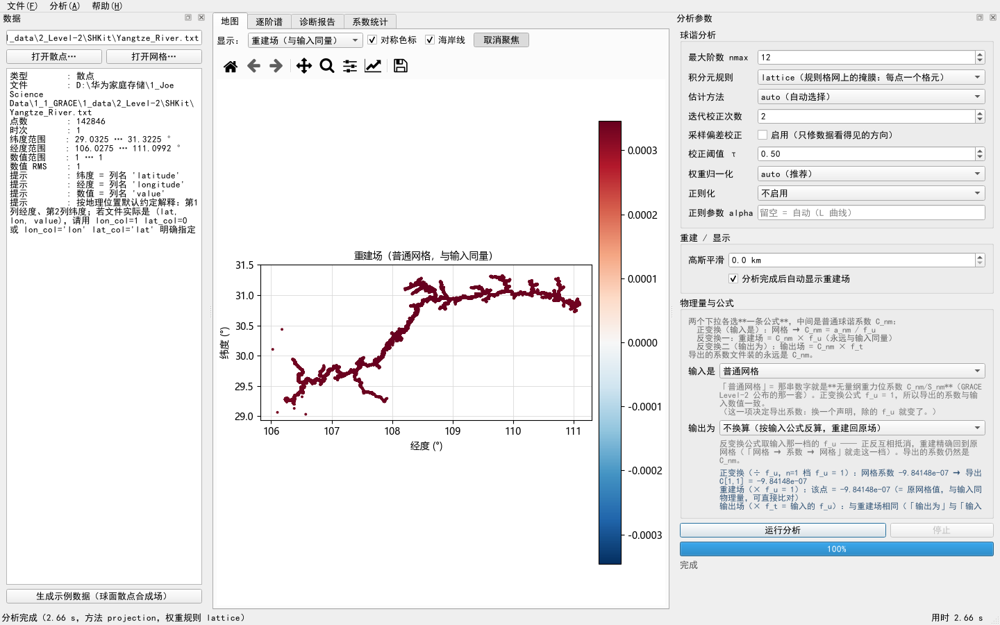

# SHKit — 任意散点 / 任意网格 ↔ 球谐系数

SHKit 是一个球谐（Spherical Harmonic, SH）分析 / 综合工具包，解决一类旧工具覆盖不了的问题：
**输入不是全球等经纬网格，而是任意分布的散点、或者只覆盖一部分地球的网格。**

Windows 10/11（64 位）桌面程序 · 免费 · 完全离线运行 · 不需要装 Python

**[⬇ 下载最新版 v2.0.1](https://github.com/pengzhenran/SHKit/releases/latest)**


## 功能

- **正变换（分析）**：任意散点 / 任意网格 → 球谐系数
- **反变换（综合）**：球谐系数 → 任意散点 / 任意网格
- **积分元（quadrature weight）自动定权**：7 种规则（`dh` / `glq` / `grid` / `voronoi` / `delaunay` / `uniform` / `user`），按采样几何自动选择
- **诊断**：求积完备性、条件数、Shannon 数、推荐阶数、逐条中文警告
- **稳健估计**：加权最小二乘、矩阵无关 CG、Tikhonov / Kaula 正则
- **球面 Slepian 局部化**：区域数据反演
- **高斯平滑 / 等效水高（EWH）换算**：逐阶因子，输入量与输出量分开声明
- **完全离线**：不联网，也不上传任何数据




## v2.0 新增

| 新增 | 一句话 |
| --- | --- |
| **批量多历元分析** `analyze-series` | 一次解完整条序列；积分元与 Gram **只算一次**，逐历元诊断表带 MAD 离群标记（只报告不剔除） |
| **经度 FFT 快路径** | 整圈均匀经度上把经度求和换成 FFT；条件不满足自动回退并写明中文理由，**绝不静默换算法** |
| **水平形变 u_N / u_E** | 位系数的球面梯度（矢量场）；极点用解析值，独立算子模块，网格走 FFT（比直接法快 14–18×） |
| **时间域算子** | 趋势 / 周年 / 半年拟合成系数序列，时间高斯平滑；缺测历元排除而不补 0 |
| **序列产品** | 点序列 / 区域平均（报覆盖率）/ 场序列 `.nc`，落盘布局与 `3_grids/*.nc` 同构 |
| **界面九个页签** | 地图、逐阶谱、诊断报告、系数统计、数值表、逐历元诊断、时间序列、趋势与周年、水平形变 |
| **交互增强** | 统一色标面板、悬停双读数、可复制数值表、时间轴控件、播放与 GIF 导出、可暂停的逐时次导出 |
| **缓存与隔离** | 分析结果按「源文件指纹 + 全部影响参数」缓存（拷到别的机器仍命中）；批量分析在 spawn 子进程里跑，子进程被强杀界面照常可用 |

实测（181×360 全球网格、`nmax=60`、203 历元）：批量分析直接法 5.07 s → **FFT 0.53 s**。

## 精度与验证

所有结论都可复现：**19 套脚本共 1161 项检查全绿**（含 GUI 离屏冒烟、单位换算、水平形变、多时间批处理、经度 FFT、时间域算子、序列产品与发布验收）。

| 项目 | 实测结果 |
| --- | --- |
| Driscoll–Healy 全球网格恢复带限场 | 1.35e-15 |
| GLQ 网格（L=20，861 点） | 5.09e-15 |
| 用 Voronoi 积分元 vs 统一面积（聚簇散点） | 系数相对误差 1.27e+00 → 1.29e-01（**9.8×**） |
| 迭代校正提升往返精度 | 7.4e-04 → 3.0e-06（**247×**） |
| Slepian 集中比独立验证 | 5.7e-15 |
| 经度 FFT vs 直接法 | 相对差 ≤1.2e-14 |

### 三条必须知道的坑

1. **区域散点不能用 Voronoi 面积**：球面 Voronoi 剖分永远铺满整个球面，区域边界点的胞会膨胀到球的对侧。实测 30° 球冠真实面积 0.842，Voronoi 面积和 **12.566**（虚高 14.9 倍）。区域散点请用 `delaunay`。
2. **`Δφ·Δλ·cosφ` 是近似**：精确球带面积是 `Δλ(sinφ₂−sinφ₁)`，前者系统性偏大 `(Δφ)²/24`（1° 步长时 1.27e-5）。请用 `rule='grid'`。
3. **`S_n0 ≡ 0`**：正弦基必须只取 `m ≥ 1`，未知数个数是 `(L+1)²` 而不是 `2·(L+1)(L+2)/2`。搞错会让最小二乘系统秩亏。

## 安装

- 安装包约 **92.1 MB**，装完即用，**不需要 Python**（Python 运行时、Qt、绘图库都在包内）
- 下载：[Releases](https://github.com/pengzhenran/SHKit/releases/latest) 页面中的 `SHKit_Setup_v2.0.1.exe`
- 国内下载较慢，也可以用夸克网盘：<https://pan.quark.cn/s/6a75cb4f4683>（二维码见文末）
- 双击安装程序按向导完成：默认**按用户安装**（不弹管理员）到 `%LOCALAPPDATA%\Programs\SHKit`；
  开始菜单生成 `SHKit` / `使用说明 (HTML)` / `卸载 SHKit`，可选桌面快捷方式
- 卸载通过「设置 → 应用」或开始菜单中的卸载项

SHA256（v2.0.1）：

```
84A82759FBD53CC6DCF547C3A130F777CDBFA43050C585C3851098770E009282
```

### 首次运行可能被 Windows 拦下

程序与安装包都没有代码签名。新装的 Windows 11 上会遇到下面两种提示之一：

| 提示 | 怎么办 |
| :--- | :--- |
| 「Windows 已保护你的电脑 / 未知发布者」 | 点「更多信息」→「仍要运行」 |
| 「智能应用控制已阻止可能不安全的应用」 | 这是 Windows 11 的智能应用控制，**没有单应用白名单**：设置 → 隐私和安全性 → Windows 安全中心 → 应用和浏览器控制 → 智能应用控制 → 关闭，然后重新双击程序（不必重装） |

换安装目录、卸载重装都不能绕过第二种提示——它只看数字签名，不看路径。关闭智能应用控制不影响 Windows 自带的病毒防护。

## 验证安装

```cmd
"%LOCALAPPDATA%\Programs\SHKit\SHKit.exe" --self-test
```

装到 `Program Files` 时把路径换成 `"C:\Program Files\SHKit\SHKit.exe"`。

## 三分钟上手

### 界面

双击开始菜单里的 `SHKit`，或桌面快捷方式。左侧**数据**面板（载入散点 / 网格、变量选择、时次滑块、数据摘要），
右侧**分析参数**面板（`nmax`、积分元规则、估计方法、迭代校正、正则化、高斯平滑、「输入是 / 输出为」两档），
中间九个页签。没有数据时点「生成示例数据」即可立即试用。

界面内按 **F1** 打开随包的截图版使用说明（九个页签各一张整窗截图，离线可读）。

### 命令行

程序自带命令行入口（`SHKit.exe --cli …` 或用源码里的 `python -m shkit.cli`）：

```bash
shkit weights  --points data.csv --rule voronoi --out w.csv
shkit analyze  --points data.csv --nmax 60 --method auto --out-prefix out/run1
shkit analyze  --points grid.nc --nmax 120 --rule dh --gaussian-km 300 --reconstruct
shkit synth    --coeffs model.sh --out-grid recon.nc --lat-step 1 --lon-step 1
shkit roundtrip --points data.csv --nmax 60 --rule voronoi
shkit info     --coeffs model.sh
shkit nmax     --coeffs model.sh          # 该用多少阶？一条命令回答

shkit series-read    --source grace_gfc/ --out csr.nc --summary
shkit analyze-series --points ewh.nc --nmax 60 --out-series csr_coeffs.nc --out-summary epochs.csv
shkit timefit        --series csr.nc --poly-order 1 --periods 1.0,0.5 --out-prefix out/fit
shkit series-grid    --series csr.dat --nmax 60 --target-unit ewh --gaussian-km 300 --out out/ewh_series.nc
shkit basin-average  --series csr.dat --points basin.csv --out out/basin.csv
```

### Python API

```python
from shkit.analysis import analysis
from shkit.synthesis import synthesis, synthesis_grid

coeffs, report = analysis(lat, lon, f, nmax=60, method="auto", rule="auto")
print(report.describe())      # 覆盖率、条件数、Shannon 数、推荐阶数、警告

vals = synthesis(lat, lon, coeffs)                       # 任意散点
g    = synthesis_grid(lat_vec, lon_vec, coeffs)          # 规则网格
g_sm = synthesis_grid(lat_vec, lon_vec, coeffs, gaussian_km=300)
g_ewh = synthesis_grid(lat_vec, lon_vec, coeffs, ewh=True)
```

## 「该用多少阶？」——由三个互相独立的约束决定

1. **截断（数据带宽）**：重建误差 = `sqrt(1 − 保留功率比)`，由 Parseval 精确给出，与采样密度无关
2. **采样 / 覆盖**：`lmax_recommended(n_points, coverage)`
3. **区域（coverage < 1）**：`Shannon = (L+1)²·coverage`，以及使 Shannon ≈ 1 所需的阶数

同一份 `L_true=60` 的数据只在 `nmax=12` 上分析，重建误差完全由谱形状决定：白谱 91.6%、Kaula 型 31.1%、红谱 2.56%。诊断报告里的 `fit_rmse_rel` 就是这个数，不用自己做往返。

**非全球覆盖的本质限制**：区域数据在原理上不能唯一确定全球球谐系数（存在零空间）。一个面积占比 4.3% 的球冠连 degree-4 的场都恢复不了。正确做法是 **remove–restore**：先用全球模型扣掉长波，只在区域内分析残差，最后加回。SHKit 会在覆盖率不足、条件数过高、Shannon 数远小于系数个数时给出明确警告和推荐阶数。

## 物理量与单位：几套系数不能混用

同一个网格的数字可能代表水准面高、等效水高、面密度、径向形变或者一个无量纲场，它们的球谐系数是**不同的几套数**。从无量纲重力位系数换算到其它量，因子是**逐阶的**：

| 目标 | 从 `C_nm` 出发的逐阶因子 | 需要 |
| :--- | :--- | :--- |
| 水准面 ΔN | `R`（常数！） | — |
| 面密度 σ | `R·ρ̄/3 · (2n+1)/(1+k′ₙ)` | k′ |
| 等效水高 EWH | `Aₙ = R·ρ̄/(3ρ_w) · (2n+1)/(1+k′ₙ)` | k′ |
| 径向形变 u_r | `R·h′ₙ/(1+k′ₙ)` | k′ 与 h′ |
| 普通标量 | 不定义（不做换算） | — |

`Aₙ` 不是常数：实测 `A₀ = 1.17e7`、`A₆ = 1.68e8`，仅 0→6 阶就跨 14.3 倍。所以两套系数既不能相加、也不能"乘一个常数"互换。

程序把「**输入是**」与「**输出为**」拆成两档：输入是决定**导出什么系数、重建场是什么量**，输出为决定**输出场是什么量**。声明矛盾（例如"普通标量 → EWH"）会**直接拒绝**并给出中文说明，而不是默默给你一个差 1e7 倍的结果。随包提供完整的 **h′ / l′ / k′** 载荷勒夫数表（PREM，Wang et al. 2012）。

## 示例数据（开箱可用）

安装目录 `source\examples\` 与界面「生成示例数据」提供真值已知的数据，可直接验证：

| 文件 | 内容 | 建议积分元 | 预期系数误差 |
| :--- | :--- | :--- | :--- |
| `points_global_fibonacci.csv` | 全球准均匀散点 3000 点 | `voronoi` | ~2e-3 |
| `points_clustered.csv` | 聚簇散点 3000 点 | `voronoi` | ~3e-3（换 `uniform` 会到 1e0） |
| `points_regional_cap.csv` | 区域球冠 900 点 | **`delaunay`** | 不可比，看覆盖率与警告 |
| `grid_global_2deg.nc` | 全球 2° 网格，3 个时次 | `grid` | ~1e-3 |
| `grid_regional_1deg.nc` | 东亚区域网格 1° | `grid` | 不可比，看覆盖率与警告 |
| `truth_coeffs_20.sh` | **真值球谐系数**（带限 20 阶） | — | 与结果做差 |

## 与 SHSynth 的关系

同课题组的 **SHSynth** 做「系数 → 网格/散点」（综合）这个方向，SHKit 做「散点/网格 → 系数」（分析）。两边**逐位一致**，系数文件**双向兼容**。

- SHSynth：<https://github.com/pengzhenran/SHSynth>

## 引用

本工具实现球谐分析与综合，勒让德递推、Driscoll–Healy 权重、高斯滤波系数与载荷勒夫数表沿用
`m2py`（gridSHconvert）的算法与约定；散点积分元、迭代校正、最小二乘 / CG、正则化、Slepian 局部化与图形界面为本项目新增。

1. Wang H., Xiang L., Jia L., Wu P., Steffen H., Wang Q., Chen L. (2012). Load Love numbers and Green's functions for elastic Earth models PREM, iasp91, ak135, and modified models with refined crustal structure from Crust 2.0. Computers & Geosciences, 49, 190–199. doi:10.1016/j.cageo.2012.06.022
2. Sun J. W., Wang L. S., Peng Z. R., Fu Z. Y., Chen C (2022). The sea level fingerprints of global terrestrial water storage changes detected by GRACE and GRACE-FO data. Pure and Applied Geophysics, 179(9), 3303–3317. doi:10.1007/s00024-022-03099-5

在论文或报告中使用了本工具的计算结果，请引用上述文献。

## 许可与第三方组件

本工具自身代码采用 **MIT 许可**。图形界面使用 **PySide6-Essentials**（LGPLv3，动态链接、未修改）与 **matplotlib**（BSD 风格）；**刻意不使用** GPL-only 的 Qt Charts / Qt Data Visualization，以保证闭源分发可行。海岸线为 Natural Earth 110m（公有领域），随包离线提供。

安装目录下 `_internal\licenses\` 提供完整的第三方组件声明与许可全文（`NOTICE.txt`、`LGPL-3.0.txt`、`GPL-3.0.txt`）。

## 反馈

作者：彭桢燃（中国地质大学（武汉））　邮箱：zhenran.peng@cug.edu.cn

使用中遇到问题、发现异常结果，或希望增加新功能，欢迎提交 [Issue](https://github.com/pengzhenran/SHKit/issues) 或邮件反馈。

## 关注与获取

| 课题组公众号「地球重力与人类生活（TVGG）」 | 夸克网盘（安装包，国内下载更快） |
| :---: | :---: |
|  |  |
| 扫码关注，获取工具与更新 | 扫码打开网盘分享（`SHKit_Setup_v2.0.1.exe`） |
