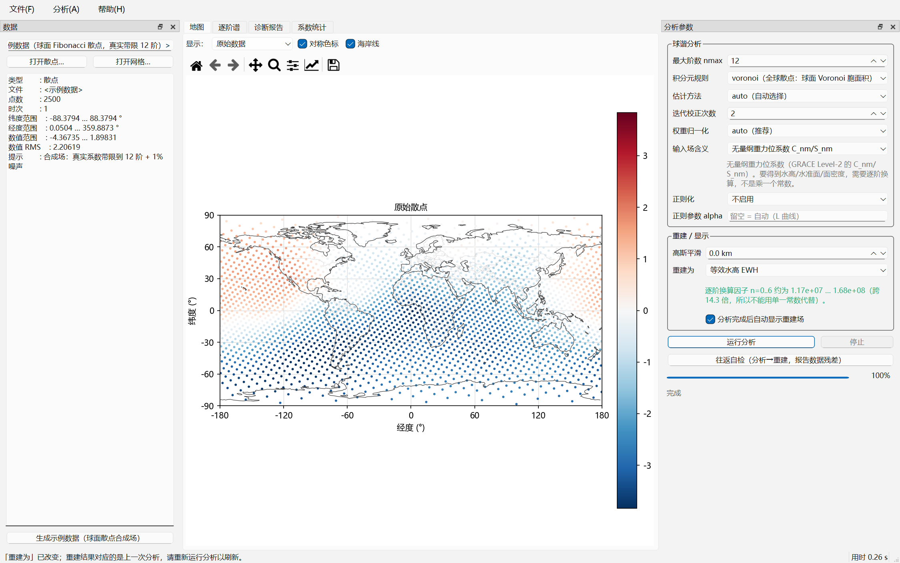
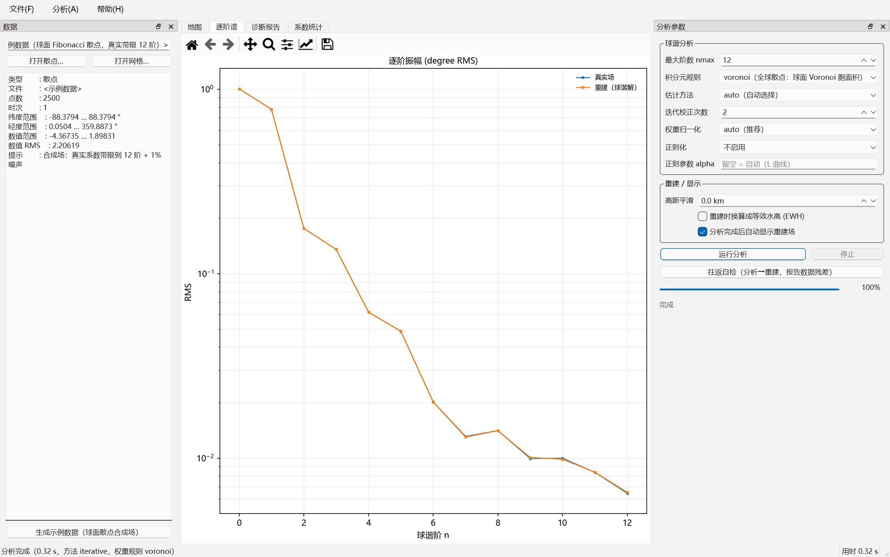

# SHKit — 任意散点 / 任意网格 ↔ 球谐系数

[]()
[]()

SHKit 是一个球谐（Spherical Harmonic, SH）分析 / 综合工具包，解决一类旧工具覆盖不了的问题：
**输入不是全球等经纬网格，而是任意分布的散点、或者只覆盖一部分地球的网格。**

- **正变换（分析）**：任意散点 / 任意网格 → 球谐系数
- **反变换（综合）**：球谐系数 → 任意散点 / 任意网格
- **积分元（quadrature weight）自动定权**：7 种规则，按采样几何自动选择
- **诊断**：求积完备性、条件数、Shannon 数、推荐阶数、逐条中文警告
- **稳健估计**：加权最小二乘、矩阵无关 CG、Tikhonov / Kaula 正则
- **球面 Slepian 局部化**：区域数据反演
- **高斯平滑 / 等效水高（EWH）换算**（逐阶因子）、**水平形变 u_N / u_E**、**时间域算子**
- 纯 Python，核心只依赖 `numpy` / `scipy`

约定：**4π 归一化**连带勒让德函数、**无 Condon–Shortley 相位**（等同 SHTOOLS 的 `norm=1, csphase=1`），
与参考实现 `m2py` / `gridSHconvert` 逐位兼容。



> 不写代码也可以直接用：打包好的 Windows 桌面版（装完即用，不需要 Python）见
> **[Releases](https://github.com/pengzhenran/SHKit/releases/latest)**，
> 最新版 `SHKit_Setup_v2.0.1.exe`。

---

## 1. 安装

只需要 numpy / scipy；`pandas`、`xarray`、`netCDF4` 是可选依赖（读写数据文件时才需要）。

```bash
git clone https://github.com/pengzhenran/SHKit.git
cd SHKit
python -m pip install -r requirements.txt      # 或用 pyproject：[gui,io,full] 可选组
python -m pip install -e .                     # 需要 shkit / shkit-gui 命令时
```

图形界面额外需要 **`PySide6-Essentials`**（LGPLv3）+ **`matplotlib`**：

```bash
python -m pip install PySide6-Essentials matplotlib
```

> ⚠️ **闭源商用注意**：请装 **`PySide6-Essentials`**，不要装完整的 `PySide6`——后者会带上
> `PySide6-Addons`，其中 Qt Charts、Qt Data Visualization 等是 **GPL-only**，会让闭源分发变成不可能。
> 绘图一律用 matplotlib（BSD 风格许可）。清单见 [`docs/许可与闭源商用说明.md`](docs/许可与闭源商用说明.md)。

不需要 cartopy：地图用自带的 Natural Earth 110m 离线海岸线（`data/coastline_110m.npz`）。

---

## 2. 快速开始（Python API）

### 2.1 散点 → 球谐

```python
import numpy as np
from shkit.analysis import analysis

lat, lon, f = ...            # 你的散点，形状 (N,)
nmax = 60

coeffs, report = analysis(lat, lon, f, nmax, method="auto", rule="auto")
print(report.describe())     # 诊断：覆盖率、条件数、Shannon 数、推荐阶数、警告
print(coeffs.summary())
```

`method="auto"` 会先做一次求积并体检：健康就直接用求积（快），不健康自动升级到加权最小二乘（稳）。
`rule="auto"` 按点分布自动选积分元（全球准均匀 → Voronoi；区域 → Delaunay）。

**散点的多时次**支持 `(N, ntime)` 的场，文件形式四种（矩阵 `.npy` 推荐、宽表列名 `value, value1…`、
列名就是日期、任意列名用 `val_col` 指定），都会读成 `values.shape == (N, ntime)`：

```python
from shkit.io import read_points
lat, lon, vals, meta = read_points("pts_mt.npy")      # vals 形如 (N, ntime)
lat, lon, vals, meta = read_points("sites.csv", val_col=["e2002", "e2003"])
print(vals.shape, meta["ntime"], meta.get("time"))    # 日期列名会落进 meta["time"]
```

⚠️ **长表（tidy）格式不支持**：一行一个「点 × 历元」+ 一列日期的表会被当成宽表解释，
这时 `read_points` 会给出**明确警告**（坐标大量重复），提示先透视成宽表——绝不让你拿着半份数据去分析。

### 2.2 网格 → 球谐

```python
from shkit.weights import compute_weights
from shkit.analysis import analysis

lat2d, lon2d = np.meshgrid(lat_vec, lon_vec, indexing="ij")   # 全球或区域、等间隔或不等间隔都行
w = compute_weights(lat2d.ravel(), lon2d.ravel(), rule="grid")
coeffs, report = analysis(lat2d.ravel(), lon2d.ravel(), grid.ravel(), 60,
                          weights=w, method="quadrature")
```

### 2.3 球谐 → 任意点 / 任意网格

```python
from shkit.synthesis import synthesis, synthesis_grid

vals = synthesis(lat, lon, coeffs)                                 # 任意散点
g    = synthesis_grid(lat_vec, lon_vec, coeffs)                    # 规则网格
g_sm = synthesis_grid(lat_vec, lon_vec, coeffs, gaussian_km=300)   # 顺手高斯平滑
g_ewh = synthesis_grid(lat_vec, lon_vec, coeffs, ewh=True)         # 顺手换算成 EWH
```

> **高斯平滑在哪一步施加？** 两种都支持，但**不要同时用**（会乘两次）：
> `analysis()` 路径（GUI 的「高斯平滑」、CLI 的 `--gaussian-km`）在分析后**逐阶乘 W 保存**，
> 导出的系数、逐阶谱、重建场都是平滑后的同一个结果，且只施加一次；
> `synthesis(..., gaussian_km=300)` 只作用于这一次合成，存下来的系数仍未平滑。
> 半径相对 `nmax` 才有意义：`nmax=12` 时 300 km 只压掉约 1%，1000 km 压掉 ~12%，3000 km 压掉 ~44%。

### 2.4 区域数据（Slepian）

```python
from shkit.slepian import slepian_analysis

coeffs, report, basis = slepian_analysis(lat_cap, lon_cap, f_cap, nmax=60,
                                         rule="delaunay", lam_min=0.5)
print(basis.spectrum())      # λ 谱：多少个 taper 可用、Shannon 数是多少
```

### 2.5 与旧软件（gridSHconvert / m2py）互操作

```python
from shkit.coeffs import SHCoeffs

tri = coeffs.to_triangle()                        # 旧软件的 out_SHCS 布局：[C;S] 三角堆叠
back = SHCoeffs.from_triangle(tri, coeffs.nmax)   # 无损还原
```

### 2.6 水平形变 u_N / u_E（v2.0 新增）

```python
from shkit.gradient import synthesis_horizontal, synthesis_horizontal_grid

out = synthesis_horizontal(lat, lon, coeffs)     # dict: north/east/magnitude/azimuth
rep = {}
g = synthesis_horizontal_grid(lat_vec, lon_vec, coeffs, report=rep)
print(rep)          # {'path': 'fft'|'direct', 'reason': ...}  ← 绝不悄悄换算法
```

| | |
| :--- | :--- |
| 公式 | `u_N = −Σ F^h_n ∂S_n/∂θ`，`u_E = +Σ F^h_n (1/sinθ) ∂S_n/∂λ`，`F^h_n = R·l′ₙ/(1+k′ₙ)` |
| 为什么不是逐阶因子 | 水平梯度把 `(n,m)` 混到 `(n±1,m)` / `(n,m±1)`，所以有独立的算子模块 |
| 极点 | `P̄_n1/sinθ` 在极点用**解析值**（`Q₁₁=√3`），`m≥2` 恰为 0；**极点不画箭头** |
| 不能反推 | 由 `(u_N,u_E)` 反推位系数只到差一个常数 C00，所以它会**拒绝**当输入 |
| 平滑 | 只有一种顺序：先逐阶乘 `W_n`（作用在系数上），再求梯度。⚠️ 球面上二者**不**可交换（实测差 24%） |

**网格走 FFT 经度路径**：整圈均匀经度且 `nlon > 2·nmax` 时自动启用，实测比直接法快 **14~18×**；
不满足时**必须**回退直接法，`auto` 会把选择与原因写进 `report`，显式 `method='fft'` 不适用时直接报错。
⚠️ 该路径**必须**处理起始经度相位 `e^{i m λ₀}`——首版漏了它，`λ₀ = -179.5°` 时误差达 150%，
而 `λ₀ = 0` 的网格上完全看不出来。契约见 [`docs/水平形变契约.md`](docs/水平形变契约.md) 的 F12。

### 2.7 时间域算子：趋势 / 周年 / 时间滤波（v2.0 新增）

```python
from shkit.timeseries import fit_time_model, trend_field, time_gaussian_filter

fit = fit_time_model(coeffs, poly_order=1, periods=(1.0, 0.5))   # 常数+趋势+年+半年
print(fit.summary())          # 条件数 / 秩 / 残差 RMS / 异常 RMS 降幅
trend = fit.term("trend")     # 单历元系数，单位 = 每历元单位 / 年
amp, doy, sigma = fit.amplitude_phase("annual")   # 振幅、峰值日、RMS 贡献
```

| | |
| :--- | :--- |
| 时间坐标 | **距跨度中点的真实经过年数 / 365.25**（不用 legacy 小数年：那套口径带闰年规则与 1e-5 跨年残差） |
| 为什么不用时间 FFT | GRACE 月度解 **27–35 天不等间隔、有缺测、个别月两个解**，按等间隔做频谱会混频 |
| 缺测历元 | 整段 C 全为 NaN 视为缺测，排除出拟合并在 `fit.excluded` 报告——**不补 0** |
| 无日期 | `kind='index'` 的时间轴**拒绝**日期相关运算；等权平均仍允许 |
| 系数域 ≡ 网格域 | 拟合按历元线性、综合逐历元线性，两者可交换（实测 2.5e-15） |
| 降幅口径 | 分母是**异常 RMS**（去时间均值），不是原始 RMS |

### 2.8 序列产品：点序列 / 区域平均 / 场序列 nc（v2.0 新增）

```python
from shkit.timeseries import series_at_points, series_grid, basin_average
from shkit.io import write_field_series, read_field_series

vals, times = series_at_points(coeffs, [40.0, -20.0], [116.0, 300.0],
                               target_unit="ewh", gaussian_km=300)
cube, times = series_grid(coeffs, lat_vec, lon_vec, target_unit="ewh", gaussian_km=300)
avg, info = basin_average(coeffs, lat_vec, lon_vec, mask, target_unit="ewh")
print(info["coverage"])      # ← 覆盖率：区域平均是「覆盖面积内」的平均

write_field_series("ewh.nc", lat_vec, lon_vec, times, cube)   # (time,lat,lon) 同构
lat, lon, t, cube, meta = read_field_series("ewh.nc")          # 折回内部约定
```

**落盘布局与 `3_grids/*.nc` 同构**：`(time, lat, lon)`、lat 降序、lon `[-180,180)`、float32，
`center`/`lmax`/`gauss_filter_km`/`grid_resolution_deg`/`units` 等属性同名；读回时全部折回
SHKit 约定（lat 升序、lon `[0,360)`、`(nlat,nlon,ntime)`），下游只面对一套约定。

⚠️ **做 EWH 异常必须先处理 C00**：GRACE GSM 的 `C00 ≡ 1`（地球总质量），直接换算会得到 ~1.2e7 m。
CLI 上是 `--drop-c00`（并打印被置零的原值），通常还要 `--remove-time-mean`。

---

## 3. 命令行（CLI）

```bash
python -m shkit.cli weights  --points data.csv --rule voronoi --out w.csv
python -m shkit.cli analyze  --points data.csv --nmax 60 --method auto --out-prefix out/run1
python -m shkit.cli analyze  --points grid.nc --nmax 120 --rule dh --gaussian-km 300 --reconstruct
python -m shkit.cli synth    --coeffs model.sh --out-grid recon.nc --lat-step 1 --lon-step 1
python -m shkit.cli roundtrip --points data.csv --nmax 60 --rule voronoi
python -m shkit.cli glq-grid --lmax 40 --out glq_grid.nc
python -m shkit.cli info     --coeffs model.sh
python -m shkit.cli nmax     --coeffs model.sh          # 该用多少阶？
python -m shkit.cli nmax     --points data.csv --nmax 60

# 多时间（v2.0）：一批单历元文件 → 一条序列；网格 → 一条序列
python -m shkit.cli series-read    --source grace_gfc/ --out csr.nc --summary
python -m shkit.cli analyze-series --points ewh.nc --nmax 60 \
       --out-series csr_coeffs.nc --out-summary epochs.csv
python -m shkit.cli timefit        --series csr.nc --poly-order 1 --periods 1.0,0.5 \
       --out-prefix out/fit --out-residual out/resid.nc --out-csv out/epochs.csv
python -m shkit.cli series-grid    --series csr.dat --nmax 60 --target-unit ewh \
       --gaussian-km 300 --out out/ewh_series.nc
python -m shkit.cli series-points  --series csr.dat --points pts.csv --out out/points.csv
python -m shkit.cli basin-average  --series csr.dat --points basin.csv --out out/basin.csv
```

（若已 `pip install -e .`，可直接用 `shkit <子命令>`。）

### 3.1 `--longitude-fft`：唯一的加速开关，只管速度

`analyze` / `analyze-series` / `synth` 都有这个开关，取值 `auto`（默认）/ `fft` / `direct`。
它**不改变结果**（两条路径实测相对差 ≤1.2e-14），只决定经度那一层求和怎么做。

| 取值 | 行为 |
| :--- | :--- |
| `auto` | 点集是完整矩形网格、经度整圈均匀、且 `nlon > 2·nmax` 时走 FFT；否则回退直接法并写**中文理由** |
| `fft` | 要求快路径；条件不满足直接**报错**（绝不静默回退） |
| `direct` | 强制通用直接法（任意几何都能用，就是慢） |

实测（181×360 全球网格，`nmax=60`；65160 点 × 203 历元）：

| 路径 | 不含逐历元残差 | 含逐历元残差表 |
| :--- | ---: | ---: |
| 逐历元循环 `analysis` | ~13 s | ~244 s |
| 批量 `analyze-series`，直接法 | 5.07 s | 17.13 s |
| **批量 + 经度 FFT** | **0.53 s** | **0.94 s** |

⚠️ **两个不要混淆的数字**：只报"求积核心 56×"会让人以为整条流水线快 56 倍，
整次调用其实只有 10–18×，因为固定成本（积分元、Gram 诊断、纬度上的勒让德递推）不随历元数增长。
`tests/validate_lonfft.py` 把**固定项与边际项分开报**，就是为了不再出这种错。

⚠️ 一个诚实的限制：经典的 **Driscoll–Healy 网格**（`nlon = 2·nlat`）在满阶 `nmax = nlat−1` 下
恰好 `nlon = 2·nmax`，**不满足**严格大于，所以拿不到这条加速（`nmax ≤ nlat−2` 才可以）。

---

## 4. 桌面图形界面（PySide6）

```bash
python -m shkit.gui              # 启动
python -m shkit.gui data.csv     # 启动并预载文件
```

或双击仓库根目录的 `启动SHKit.bat`（Windows，用 pythonw 启动不弹黑窗口；起不来时用
`启动SHKit-查看报错.bat` 看完整报错）。

界面：左侧**数据**面板（载入散点 / 网格、变量选择、时次滑块、数据摘要），右侧**分析参数**面板
（nmax、积分元规则、估计方法、迭代校正、正则化、高斯平滑、「物理量与公式」的输入 / 输出两档），
中间九个页签：**地图**、**逐阶谱**、**诊断报告**、**系数统计**、**数值表**、**逐历元诊断**、
**时间序列**、**趋势与周年**、**水平形变**。分析在后台线程运行，有实时进度条和「停止」按钮；
没有数据时点「生成示例数据」即可立即试用。

**默认参数是"效率优先"**：积分元规则 `auto`、估计方法 `quadrature`（直接求积）、迭代校正 `0`。
GUI 的估计方法下拉**不含 `auto`**——选哪条由使用者明确指定；用 `quadrature` 时若采样不是好的求积规则
会有混叠，诊断报告里的 `gram max|K−I|`（> 1e-2）会提示改用 `wlsq` / `cg`。

**帮助菜单**：`F1` 打开随仓库的**截图版使用说明** [`docs/使用说明.html`](docs/使用说明.html)
（九个页签各一张整窗截图 + 面板特写，离线可读）；纯文本版见
[`docs/使用说明_GUI.md`](docs/使用说明_GUI.md)。



---

## 5. 「该用多少阶？」—— 一条命令回答

`nmax` 由**三个互相独立**的约束共同决定，冲突就说明数据本身不支持你要的分辨率：

```bash
python -m shkit.cli nmax --coeffs out/run1.sh          # 从系数文件诊断
python -m shkit.cli nmax --points data.csv --nmax 60   # 先跑一遍分析再诊断
```

1. **截断（数据带宽）**：重建误差 = `sqrt(1 − 保留功率比)` ← Parseval，精确，与采样密度无关
2. **采样 / 覆盖**：`lmax_recommended(n_points, coverage)`
3. **区域（coverage < 1）**：`Shannon = (L+1)²·coverage`，以及使 Shannon ≈ 1 所需的阶数

实测（同一份 `L_true=60` 的数据，只在 `nmax=12` 上分析）：

| 谱形状 | `nmax=12` 保留功率 | `nmax=12` 重建误差 |
| :--- | ---: | ---: |
| α=0 白谱（最坏） | 16.1% | **91.6%** |
| α=1 Kaula 型 | 90.2% | **31.1%** |
| α=2 红谱 | 99.93% | **2.56%** |
| α=3 很红 | 100.00% | **0.17%** |

**所以"60 阶数据转 12 阶误差大不大"完全由谱形状决定**，不是由 `L_true` 单独决定；
而误差只由 `nmax` 决定，与网格多细无关。诊断报告里的 `fit_rmse_rel` 就是这个数，不用自己做往返。

### 非全球覆盖的本质限制

区域数据**在原理上不能唯一确定全球球谐系数**（存在零空间）。更反直觉的是：一个面积占比 4.3% 的球冠，
**连 degree-4 的场都恢复不了**——因为低阶场本来就弥散在全球，其集中因子恰好等于面积占比（0.0433），
远低于 0.5；能集中的 Slepian taper 都落在高阶。

所以正确的做法是 **remove–restore**：先用全球模型扣掉长波，只在区域内分析残差，最后加回。
SHKit 会在覆盖率不足、条件数过高、Shannon 数远小于系数个数时给出明确警告和推荐阶数。

---

## 6. 积分元（这是本工具的核心）

正变换公式：

```
C_nm = (1/4π) Σ_i w_i · f_i · P̄_nm(sinφ_i) · cos(m λ_i)
```

其中 `w_i` 是**积分元**，约定 `Σ(全球) w_i = 4π`。规则一览：

| `rule` | 用在哪 | 说明 |
| :--- | :--- | :--- |
| `auto`（默认） | 均可 | 网格 → `dh`/`grid`；全球准均匀散点 → `voronoi`；区域散点 → `delaunay` |
| `dh` | 全球等经纬网格 | Driscoll–Healy，要求 `nlon == 2·nlat`、`nlat` 偶数，此时**精确** |
| `glq` | 参考基准 | 用 `glq_grid(lmax)` 生成精确求积网格 |
| `grid` | **任意经纬网格（含区域）** | 精确球带面积 `Δλ(sinφ₂−sinφ₁)` |
| `voronoi` | **全球准均匀散点** | 球面 Voronoi 胞面积（scipy） |
| `delaunay` | **区域散点** | 球面 Delaunay 1/3 规则，和 = 球面凸包面积 |
| `uniform` | 等面积采样 | 每点 `4π/N`，**不要用于任意散点** |
| `user` | 兼容旧流程 | 你自己给每点的代表面积 |

### 积分元什么时候真的重要？（别被笼统说法误导）

在采样明显不均匀的数据上实测（`tools/verify_sample_data.py`，聚簇散点，系数相对误差）：

| 估计方法 | `voronoi` | `uniform`（旧做法） | 差距 |
| :--- | ---: | ---: | :--- |
| **求积投影** | 1.4e-02 | **1.089** | **79 倍** |
| **迭代校正 ×3** | 3.2e-03 | **444**（发散） | — |
| **WLSQ** | 3.2e-03 | 3.1e-03 | 基本无差别 |

三点结论：① 积分元作为"求积权重"时非常关键，采样越不均匀越关键，用错权重时迭代校正甚至不收敛；
② 积分元作为"最小二乘的行权重"时几乎不影响结果（最小二乘对任意正的行权重都是一致的）——
**"积分元"与"统计权重"是两个不同的东西，不要混**；③ 采样本身准均匀时（Fibonacci）两者几乎无差别。

### ⚠️ 三条必须知道的坑

1. **区域散点不能用 Voronoi 面积。** 球面 Voronoi 剖分永远铺满整个球面，区域边界点的胞会膨胀到球的对侧。
   实测：30° 球冠真实面积 0.842，Voronoi 面积和 **12.566**（虚高 **14.9 倍**，因为恒等于 4π）。
   区域散点请用 `delaunay`，或给 `rule='voronoi', subset=mask`（剖分在全点集上做）。
2. **`Δφ·Δλ·cosφ` 是近似。** 精确球带面积是 `Δλ(sinφ₂−sinφ₁)`，前者系统性**偏大** `(Δφ)²/24`
   （1° 步长时 1.27e-5，实测与理论完全一致）。用 `rule='grid'`。
3. **`S_n0 ≡ 0`。** 因为 `sin(0·λ)=0`，正弦基必须只取 `m ≥ 1`，未知数个数是 `(L+1)²`
   而不是 `2·(L+1)(L+2)/2`。搞错会让最小二乘系统秩亏。

### 选择决策树

```
输入是全球或近全球的规则网格？
├─ 是，且 nlon == 2·nlat，nlat 偶数 ──────► rule='dh'，method='quadrature'   （精确、最快）
├─ 是，其他情形 ─────────────────────────► rule='grid'，method='quadrature'
└─ 否（散点 / 有缺口 / 只覆盖一个区域）
   ├─ 覆盖良好（N ≳ 4(L+1)²，无明显空洞）─► rule='voronoi'，method='auto'
   └─ 只覆盖一个区域 ────────────────────► rule='delaunay'
                                          ├─ 要"区域可解释的量" ─► slepian_analysis()
                                          └─ 要"全球系数" ──────► analysis(method='wlsq', reg='kaula')
```

**无论走哪条路，都先读 `report.describe()` 的警告。**

---

## 7. 物理量与单位：几套系数不能混用

同一个网格的数字可能代表**水准面高、等效水高、面密度、径向形变**或者一个**无量纲场**，
它们各自的球谐系数是**不同的几套数**。从无量纲重力位系数（GRACE Level-2 的 `C_nm, S_nm`）
换算到其它量，因子是**逐阶的**：

| 目标 | 从 `C_nm` 出发的逐阶因子 | 需要 |
| :--- | :--- | :--- |
| 水准面 ΔN | **`R`（常数！）** | — |
| 面密度 σ | `R·ρ̄/3 · (2n+1)/(1+k′ₙ)` | k′ |
| 等效水高 EWH | `R·ρ̄/(3ρ_w) · (2n+1)/(1+k′ₙ)` = `Aₙ` | k′ |
| 径向形变 u_r | `R·h′ₙ/(1+k′ₙ)` | k′ 与 **h′** |
| 普通标量 | 不定义（不做换算） | — |

**`Aₙ` 不是常数**：实测 `A₀ = 1.17e7`、`A₆ = 1.68e8`，仅 0→6 阶就跨 14.3 倍。
所以两套系数既不能相加、也不能"乘一个常数"互换；重复乘一次 `Aₙ` 会放大 1e7~1e8 倍。

SHKit 的框架是**两条公式、一个中间量、两个场**：

```
正变换（由「输入是」决定）：  输入网格 --公式--> 经典无量纲位系数 C_nm
反变换一（永远如此）：        重建场 = C_nm × f_u   ← 与输入同物理量，可直接比对
反变换二（由「输出为」决定）： 输出场 = C_nm × f_t   ← 另一个物理量的场
```

即 `C_nm = a_nm / f_u`（`a_nm` 是该网格自身的球谐系数）。**导出的系数文件装的永远是 `C_nm`。**

```python
coeffs, rep = analysis(lat, lon, grid, 60, field_unit="ewh")   # 正变换公式：÷Aₙ
recon   = synthesis(lat, lon, coeffs, target_unit="ewh")       # 重建场：×Aₙ（= 输入同一物理量）
outfield= synthesis(lat, lon, coeffs, target_unit="geoid")     # 输出场：×R
```

**重建场**取 `f_t = f_u`，正反两条公式互相抵消，所以它与输入网格同物理量、可以直接逐点比对
（差值图、残差 RMS、往返校验都看它）。**输出场**才是换算出来的另一个物理量。
声明矛盾（例如"普通标量 → EWH"）会直接**拒绝**并给出中文说明。

**改「输入是」会改变导出的系数**（同一块网格声明成 geoid 和声明成 EWH 是两个不同的物理场）；
**改「输出为」既不改变导出的系数，也不改变重建场**，它只换输出场：

```
输入=ewh, 输出=ewh              导出 C[2,1] = -2.190855366513e-09  重建场 RMS = 2.206131e+00  输出场 RMS = 2.206131e+00
输入=ewh, 输出=geoid            导出 C[2,1] = -2.190855366513e-09  重建场 RMS = 2.206131e+00  输出场 RMS = 8.274777e-01
输入=ewh, 输出=surface_density  导出 C[2,1] = -2.190855366513e-09  重建场 RMS = 2.206131e+00  输出场 RMS = 2.206131e+03
```

随包提供完整的 **h′ / l′ / k′** 载荷勒夫数表（`data/load_love_numbers.npz`，来自 PREM-LLNs.dat，
Wang et al. 2012），其中 `k′` 与旧软件 `m2py` 的表逐值一致到 9.7e-17。注意 `h′₀ = 0`，
所以**径向形变不能当输入**反推位系数的 0 阶（会明确报错）。

完整公式推导、实测因子表、会被拦截的错误清单见 [`docs/物理量与单位换算.md`](docs/物理量与单位换算.md)。

---

## 8. 示例数据（开箱可用）

`sample_data/` 里有 7 份数据 + 1 份真值系数，**真值已知**，可直接载入界面验证：

| 文件 | 内容 | 建议积分元 | 预期系数误差 |
| :--- | :--- | :--- | :--- |
| `points_global_fibonacci.csv` | 全球准均匀散点 3000 点 | `voronoi` | ~2e-3 |
| `points_clustered.csv` | 聚簇散点 3000 点 | `voronoi` | ~3e-3（换 `uniform` 会到 1e0） |
| `points_regional_cap.csv` | 区域球冠 900 点 | **`delaunay`** | 不可比，看覆盖率与警告 |
| `grid_global_2deg.nc` | 全球 2° 网格，**3 个时次** | `grid` | ~1e-3 |
| `grid_regional_1deg.nc` | 东亚区域网格 1° | `grid` | 不可比，看覆盖率与警告 |
| `grid_global_5deg.grd` | 全球 5° 网格（Surfer ASCII） | `grid` | ~2e-3 |
| `truth_coeffs_20.sh` | **真值球谐系数**（带限 20 阶） | — | 与结果做差 |

另外 `examples/` 有长江流域的完整算例（`README_yangtze.md`：散点、掩膜、142846 行逐点积分元、
重建结果与诊断），可复现 `docs/SHKit方法总结.html` 里的全部数字。

```bash
python tools/make_sample_data.py       # 重新生成示例数据
python tools/verify_sample_data.py     # 打印每份数据的预期误差
python examples/demo_workflow.py       # 端到端四场景演示（输出见 examples/demo_output.txt）
```

---

## 9. 验证

所有结论都可复现，**19 套脚本共 1161 项检查全绿**（含 GUI 离屏冒烟、单位换算、水平形变、
多时间批处理、经度 FFT、时间域算子、序列产品与发布验收）。一条命令跑全部：

```bash
python tests/run_all.py              # 19 套 1161 项，一次跑完并汇总
python tests/run_all.py --fast       # 跳过两个 GUI 套件
```

| 套件 | 项数 | 内容 |
| :--- | ---: | :--- |
| `validate_core.py` | 45 | 勒让德、DH/GLQ 精确性、积分元对比、区域陷阱、多时次回归、LSQ/CG、往返 |
| `validate_projection.py` | 28 | 零填充全球投影目标函数 + C00 守卫 |
| `validate_slepian.py` | 22 | 高斯滤波、Slepian 集中比、区域反演稳定性 |
| `validate_units.py` | 50 | 换算因子（与手算核对）、正反变换公式、防重复换算、载荷勒夫数表、单位线性性 |
| `validate_physics.py` | 18 | **绝对物理验证**（总质量、解析谐波、`Aₙ` 第一性原理）——不靠往返 |
| `validate_timeaxis.py` | 73 | 时间轴（legacy 小数年口径、两个反例、不静默广播、数值型 netCDF 时间） |
| `validate_series.py` | 47 | 多历元序列读写（`series_nc` 往返 / legacy `.dat` 双向 / 缺测报告） |
| `validate_batch.py` | 37 | 批量多历元分析（与逐历元逐位等价、权重与 Gram 只算一次、MAD 离群检出） |
| `validate_lonfft.py` | 74 | 经度 FFT（硬条件、起始经度相位回归 + 反例、实测加速） |
| `validate_timeseries.py` | 84 | 时间域算子（趋势/周年/半年拟合、系数域 ≡ 网格域、时间滤波 vs 手算） |
| `validate_products.py` | 55 | 序列产品（场序列 nc 往返、点序列 ≡ 场序列、区域平均、与真实 `3_grids` 对表） |
| `test_horizontal_golden.py` | 45 | 水平形变跨包冻结契约（黄金样本、解析锚点、差分铁律） |
| `validate_horizontal.py` | 66 | 水平形变包内实现（含 **6 个起始经度相位回归**） |
| `test_vs_shsynth.py` | 16 | 与 SHSynth 逐值对表（咨询性：对方缺陷不阻塞本包） |
| `test_io_roundtrip.py` | 36 | 系数 5 种布局、散点、网格往返、非 ASCII 路径、并发打开、多时次懒加载 |
| `test_cli.py` | 33 | 七个核心子命令 + 错误路径 + `--longitude-fft` + `nmax` 诊断 |
| `validate_v2.py` | 82 | v2.0 发布验收：一条真实使用链 + 跨阶段口径复核 + 发版信息同步 |
| `test_gui_units.py` | 24 | 走真实窗口路径证明「改『输入是』会改变导出系数」 |
| `test_gui_smoke.py` | 197 | GUI 离屏冒烟（交互项、布局稳定、懒加载、缓存、子进程崩溃隔离…） |

关键实测数字（详见 [`docs/方案调研.md`](docs/方案调研.md) 第 7 节）：

| 项目 | 结果 |
| :--- | :--- |
| DH 全球网格恢复带限场 | 1.35e-15 |
| GLQ 网格（L=20, 861 点） | 5.09e-15 |
| Voronoi vs 统一面积（随机散点） | 2.43e-01 → 2.27e-02（**10.7×**） |
| Voronoi vs 统一面积（聚簇散点） | 1.27e+00 → 1.29e-01（**9.8×**） |
| 区域 Voronoi 虚高 | **14.9×** |
| 迭代校正提升往返精度 | 7.4e-04 → 3.0e-06（**247×**） |
| Slepian 集中比独立验证 | 5.7e-15 |
| Slepian vs WLSQ 条件数 | 1.44 vs 2.18e+16 |

> 教训（对表时必读）：**"两边图形长得像"不等于"数值口径一样"**。把 CSR 序列做成 EWH 场与
> `3_grids/CSR_GRACE_EWH_G300.nc` 比，300 km 下空间相关 0.961，但参考场的 EWH 恰好是标准 Wahr 公式的
> **1/√(4π)**（低阶最小二乘标度 3.5523 vs √(4π) = 3.5449，比值 1.002），高阶还要额外压制 3.6%。
> 对表必须**同时报标度**，而标度要按阶分离看（低阶定标度、高阶看衰减）。SHKit 的 `Aₙ` 另有第一性原理
> 验证（1 m 水层 → EWH = 1 m），**所以这不是 SHKit 的错**。

---

## 10. 目录结构

```
SHKit/
├─ shkit/
│  ├─ coeffs.py       SHCoeffs 容器、矩阵/三角双布局
│  ├─ basis.py        勒让德递推（列生成器，省内存）、设计矩阵、综合、
│  │                  水平梯度用的 (P̄, dP̄/dθ, P̄/sinθ) 三合一列生成器
│  ├─ weights.py      7 种积分元规则 + 归一化 + 体检
│  ├─ diagnostics.py  AnalysisReport（Gram 偏离 / 条件数 / Shannon / 推荐阶数 / 警告）
│  ├─ analysis.py     求积 / 迭代校正 / WLSQ / CG / 正则 / method='auto'
│  ├─ synthesis.py    任意点、任意网格、分块综合
│  ├─ filters.py      高斯滤波、载荷勒夫数
│  ├─ gradient.py     球面水平梯度 + 水平形变 u_N/u_E（极点解析处理、FFT 经度路径）
│  ├─ units.py        物理量标签与换算（geoid / 面密度 / EWH / 径向形变 / 水平形变）
│  ├─ slepian.py      球面 Slepian 局部化
│  ├─ lonfft.py       经度 FFT 共用件（`longitude_phase()` 起始经度相位）
│  ├─ timeaxis.py     时间轴（legacy 小数年、netCDF 数值时间）
│  ├─ timeseries.py   时间域算子与序列产品（趋势/周年、点序列、区域平均）
│  ├─ series.py       多时次系数容器与序列读写
│  ├─ io.py           读写散点/网格/系数（csv、grd、nc、gfc、npy、npz…）
│  ├─ cli.py          命令行
│  └─ gui/            PySide6 桌面界面（app / main_window / workers / canvases / dataset）
├─ data/              载荷勒夫数表 + 离线海岸线（Natural Earth 110m）
├─ docs/              方案调研、物理量与单位换算、水平形变契约、时间与序列方案、
│                     使用说明.html（截图版说明书）+ 使用说明_img/、许可与闭源商用说明
├─ examples/          端到端演示 + 长江流域算例（散点/掩膜/逐点积分元）
├─ licenses/          LGPL-3.0 / GPL-3.0 / NOTICE
├─ packaging/         PyInstaller spec + build_installer.ps1 + BUILD_ENV.md
├─ sample_data/       示例数据（真值已知）
├─ tests/             19 套测试，共 1161 项检查
├─ tools/             生成/校验示例数据、勒夫数表、许可自检、源码编码自检
├─ installer_shkit.iss  Inno Setup 安装脚本
├─ 启动SHKit.bat       双击启动 GUI
└─ 启动SHKit-查看报错.bat
```

### 文档一览

| 文档 | 内容 |
| :--- | :--- |
| [`README.md`](README.md) | 总览、安装、API/CLI、积分元、单位、验证数字 |
| [`docs/方案调研.md`](docs/方案调研.md) | 方法与方案细节、全部实测数字、已知局限 |
| [`docs/使用说明.html`](docs/使用说明.html) | 截图版使用说明（九个页签），离线可读 |
| [`docs/使用说明_GUI.md`](docs/使用说明_GUI.md) | 纯文本版界面说明 |
| [`docs/物理量与单位换算.md`](docs/物理量与单位换算.md) | 逐阶因子 `Aₙ` / geoid / σ / EWH / u_r 的公式与实测值 |
| [`docs/水平形变契约.md`](docs/水平形变契约.md) | 水平形变的冻结契约（含 F12 相位条目） |
| [`docs/多时间数据处理方案.md`](docs/多时间数据处理方案.md) | 批量多历元与序列产品的方案与实测 |
| [`docs/许可与闭源商用说明.md`](docs/许可与闭源商用说明.md) | LGPLv3 义务与闭源合规做法 |
| [`packaging/BUILD_ENV.md`](packaging/BUILD_ENV.md) | 打包环境怎么建、踩过的坑 |

---

## 11. 打包成安装程序

```powershell
conda create -n shkit-gui -y -c conda-forge python=3.12 pip     # 只建空环境
$py = "$env:USERPROFILE\anaconda3\envs\shkit-gui\python.exe"    # 其余包用 pip 装
& $py -m pip install numpy scipy matplotlib PySide6-Essentials pandas xarray netCDF4 psutil openpyxl pyinstaller
conda install -n shkit-gui -y -c conda-forge libffi             # _ctypes 需要 ffi-8.dll

cd SHKit
powershell -ExecutionPolicy Bypass -File packaging\build_installer.ps1 -VerifyInstall
# → D:\SHKit_build\dist\SHKit_Setup_v2.0.1.exe  （92 MB，装完即用，不需要 Python）
```

> **实测**（2026-09-13）：目录包 317 MB / 1318 个文件、`SHKit.exe` 17.1 MB、安装程序 **92 MB**；
> `-VerifyInstall` 静默装到临时目录 → 文件核对全 OK → 装完的 exe 启动正常且 `--self-test` 9/9 →
> 自动卸载清理，脚本退出码 0。两个**必须自己补的前提**（细节见 BUILD_ENV.md §6）：
> ① Inno 自带语言包**没有简体中文**，要另放 `ChineseSimplified.isl` 到 `<Inno Setup>\Languages\`；
> ② `build_installer.ps1` 与 `installer_shkit.iss` **必须保持 UTF-8 with BOM**
> （没有 BOM 时 PowerShell 5.1 按 GBK 读、脚本解析就报错），`tests/validate_v2.py` 有两条断言守着它。

---

## 12. 依赖

- 必需：`numpy`、`scipy`
- 可选：`pandas`（csv/xlsx）、`xarray` + `netCDF4`（.nc）、`psutil`（自动内存分块）
- GUI：`PySide6-Essentials`（LGPLv3）+ `matplotlib`（BSD 风格）
- 不需要 cartopy：地图用自带的 Natural Earth 110m 离线海岸线

## 13. 许可与出处

SHKit 自身代码：**MIT**。

- 勒让德递推、Driscoll–Healy 权重、高斯滤波系数、载荷勒夫数表沿用 `m2py`（gridSHconvert）的算法与约定，
  以保证与既有结果一致；
- 散点积分元、迭代校正、最小二乘/CG、正则化、Slepian 局部化、GUI 为本项目新增；
- GUI 使用 **PySide6**（LGPLv3，动态链接、未修改）与 **matplotlib**。
  **刻意不使用** GPL-only 的 Qt Charts / Qt Data Visualization。
- 海岸线数据为 Natural Earth 110m（公有领域），随包离线提供。

第三方组件清单见 `licenses/NOTICE.txt`；闭源商用的完整合规清单见
[`docs/许可与闭源商用说明.md`](docs/许可与闭源商用说明.md)。

## 14. 相关项目

同课题组的 **SHSynth** 做「系数 → 网格/散点」（综合）这个方向，SHKit 做「散点/网格 → 系数」（分析）。
两边**逐位一致**，系数文件**双向兼容**。

- SHSynth：<https://github.com/pengzhenran/SHSynth>

## 15. 反馈

作者：彭桢燃（Zhenran Peng），中国地质大学（武汉）　邮箱：zhenran.peng@cug.edu.cn
课题组公众号「地球重力与人类生活（TVGG）」

使用中遇到问题、发现异常结果，或希望增加新功能，欢迎提交
[Issue](https://github.com/pengzhenran/SHKit/issues) 或邮件反馈。

## 关注与获取

| 课题组公众号「地球重力与人类生活（TVGG）」 | 夸克网盘（Windows 安装包，国内下载更快） |
| :---: | :---: |
|  |  |
| 扫码关注，获取工具与更新 | 扫码打开网盘分享（`SHKit_Setup_v2.0.1.exe`） |
