# SHKit 图形界面使用说明

> 版本 2.0　·　作者：彭桢燃（Zhenran Peng），中国地质大学（武汉）
> 邮箱 zhenran.peng@cug.edu.cn　·　电话 15927402265
> 课题组公众号「地球重力与人类生活 (TVGG)」

> 📘 菜单 **帮助 → 📘 使用说明**（快捷键 **F1**）打开的是**截图版说明书**，
> 带界面截图与示例配图，离线可读；本 Markdown 是它的纯文本版，作为兜底。
> **帮助 → ℹ️ 关于 / 作者信息** 里有作者、单位、邮箱、电话、**公众号二维码**
> 与六步快速上手。

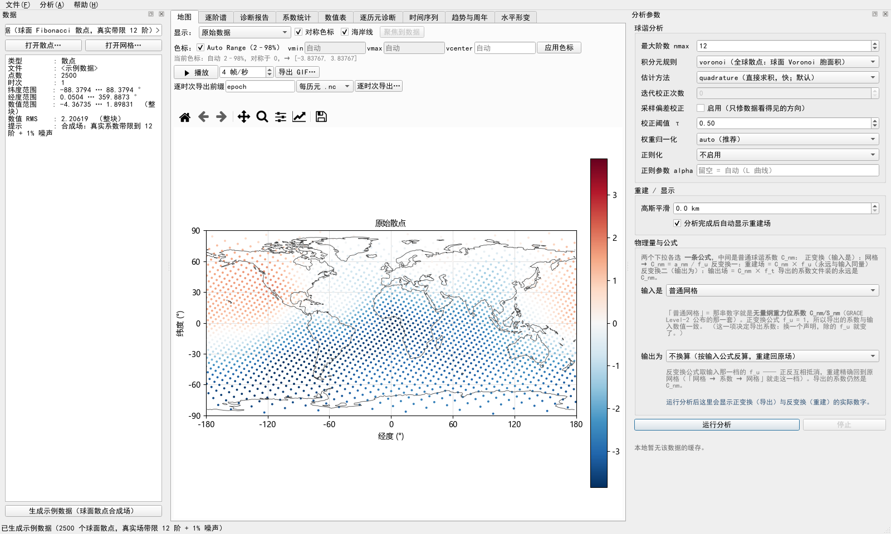

---

## 0. 三十秒上手

1. 「文件 → 打开散点/网格」载入数据（没有数据就点「生成示例数据」先试一遍）；
2. 「输入是」选**正变换公式**（这串数是什么），「输出为」选**输出场**是什么物理量
   —— 只做「网格 → 系数 → 网格」往返的话两者都保持默认；
3. 「最大阶数 nmax」按需设；拿不准就先用默认值跑一次，诊断报告里的
   **「推荐 nmax」**会告诉你这块数据撑得住多少阶；
4. 点**运行分析**（F5）。积分元规则默认 `auto`、估计方法默认 `quadrature`
   （直接求积），一次投影就出结果；
5. 地图页签看「原始 / 重建场（与输入同量）/ 差值 / 输出场」，另外八个页签是
   逐阶谱、诊断报告、系数统计、数值表、逐历元诊断、时间序列、趋势与周年、水平形变；
6. **数据带时间（多时次/多历元）时**：地图页上方会出现时次滑块与范围，点
   **逐历元诊断**页的「批量分析」一次解出所有历元（权重只算一次，比逐历元点快得多），
   再在**时间序列**／**趋势与周年**页看时间变化；
7. 「文件」菜单导出系数 / 重建场 / 输出场 / 报告，地图页的**逐时次导出**一次导出
   整个时间序列（可暂停、可停止）。

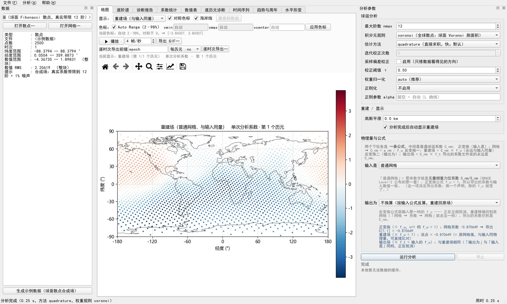

---

## 1. 安装

SHKit 以 **Windows 安装程序**发布，**装完即用**：

1. 双击安装程序 `SHKit_Setup_v2.0.1.exe`；
2. 如果 Windows 弹出「用户账户控制」，选**是**；
3. 按向导点「下一步」（需要改安装位置就在这一步改），再点「安装」；
4. 等进度条走完，点「完成」。

**不需要装 Python，也不需要 pip、不需要联网激活。** 运行所需的组件、离线海岸线与
勒夫数表、本说明书与全部配图都已经打进安装包；装完桌面与开始菜单会出现 **SHKit**
快捷方式。

| 项目 | 要求 / 说明 |
| --- | --- |
| 操作系统 | Windows 10 / 11（64 位） |
| 内存 | 建议 8 GB 以上；区域数据、高阶（nmax > 100）时更吃内存 |
| 磁盘占用 | 约 400 MB（预留 600 MB 更稳妥） |
| 卸载 | 「设置 → 应用」或开始菜单的卸载项 |

> 若拿到的是绿色版压缩包：解压到任意目录（路径尽量不含空格），双击 `SHKit.exe`
> 即可运行，无需安装。

## 2. 启动

双击桌面 **SHKit** 图标（或开始菜单里的 SHKit）。程序**完全离线**运行，
不联网、不上传任何数据。首次打开建议先点 **「生成示例数据」**，用内置算例把整条
流程走一遍，然后再打开自己的数据。

---

## 3. 界面总览

窗口分四块：

| 区域 | 内容 |
| --- | --- |
| **左：数据** | 打开散点 / 打开网格、NetCDF 变量选择、时次滑块、数据摘要（范围、RMS、提示） |
| **中：页签** | 地图 / 逐阶谱 / 诊断报告 / 系数统计 / 数值表 / 逐历元诊断 / 时间序列 / 趋势与周年 / 水平形变（九个，见 3.2） |
| **右：分析参数** | 球谐分析参数 + 物理量与公式 + 重建显示选项 + 运行/停止 + 进度条 |
| **底：状态栏** | 当前状态、方法、权重规则、用时 |

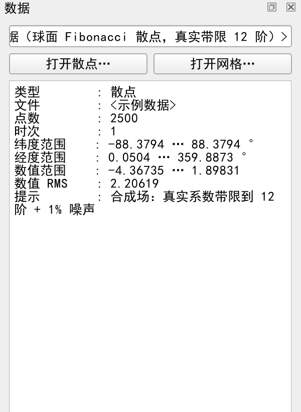

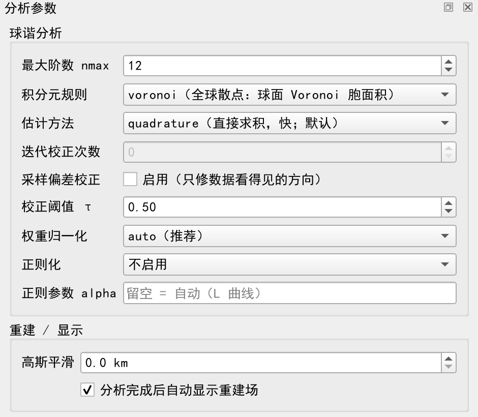

「地图」页签顶部的下拉可以在**四个场**之间切换：**原始数据**、**重建场**（与输入同
物理量）、**差值**（原始 − 重建）、**输出场**（按「输出为」换算出来的另一个物理量）。

地图页上方最多有四行控件，都只影响**显示**、不影响分析结果：

| 行 | 什么时候出现 | 作用 |
| --- | --- | --- |
| **色标控件** | 总是 | `Auto Range (2–98%)` / `vmin` / `vmax` / `vcenter` +「应用色标」，另有「对称色标」「海岸线」「取消聚焦」 |
| **色标说明** | 总是 | 单独一行写明当前色标是按什么定出来的（例如「自动 2–98%，对称于 0，→ [−0.0753, 0.0753]」） |
| **时间行** | 数据带时间轴时 | 时次滑块、◀/▶ 逐步、范围起止、「全部」、当前时次的日期与十进制年 |
| **播放行** | 同上 | 播放/暂停、帧率、**导出 GIF…**；下一行是**逐时次导出**（前缀、格式、按钮） |

**鼠标停在地图上**会显示该点的原始值、重建值、经纬度；网格数据吸附到最近格点，
散点数据吸附到最近点（并给出点号）；多时次数据还会带上「第 k / N 个时次（日期）」。

「生成示例数据」按钮会造一份 2500 点的球面 Fibonacci 散点合成场（真实带限 12 阶 +
1% 噪声），不需要任何数据文件就能把整个流程走一遍。

### 3.1 帮助菜单

| 菜单项 | 作用 |
| --- | --- |
| **帮助 → 📘 使用说明**（**F1**） | 打开**截图版说明书**（界面截图 + 示例配图，可滚动 / 可最大化） |
| **帮助 → ℹ️ 关于 / 作者信息** | 作者、单位、邮箱、电话、**公众号二维码**，以及六步快速上手 |
| **帮助 → 📱 课题组公众号** | 放大显示公众号二维码 |
| **帮助 → 第三方许可与声明…** | 本程序使用的第三方组件清单 |
| **帮助 → GNU LGPL v3 / GPL v3 全文…** | 随程序分发的许可全文 |

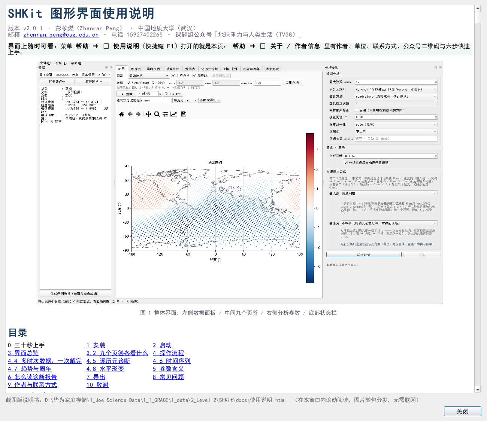

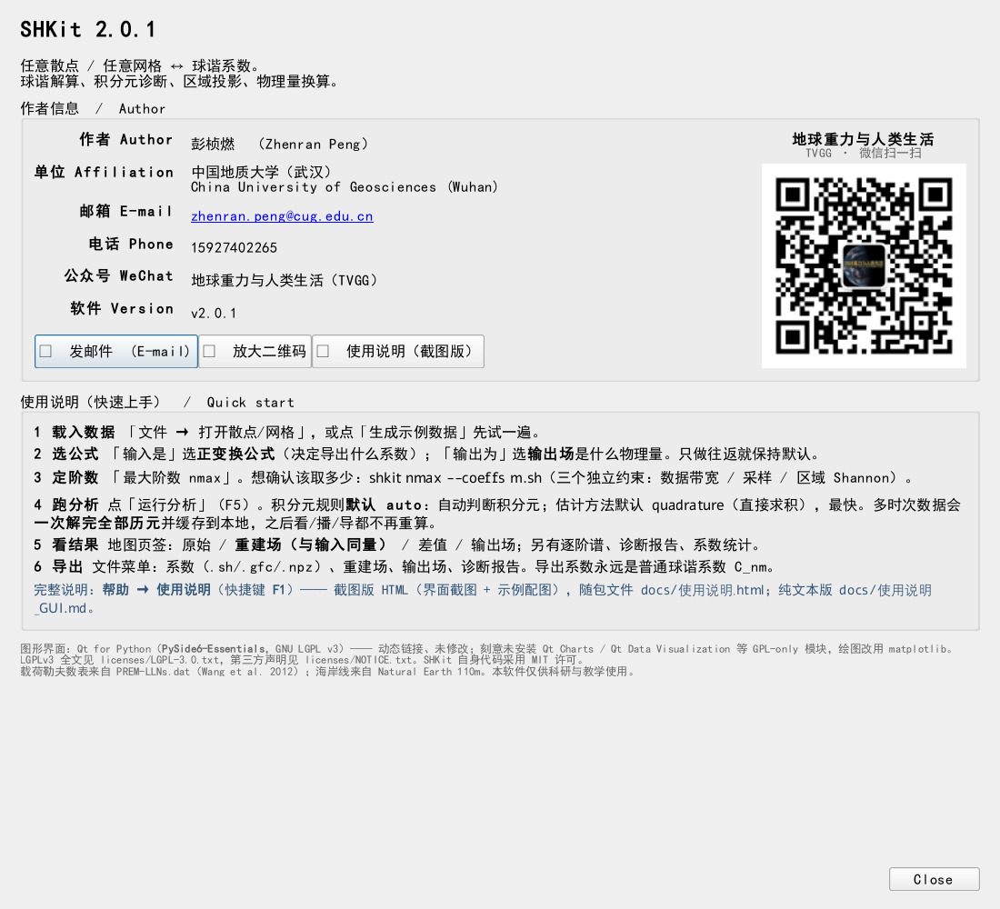

### 3.2 九个页签各看什么

| 页签 | 内容 | 什么时候看 |
| --- | --- | --- |
| **地图** | 四个场的平面图 + 色标 + 悬停读数 | 看空间分布；每次都从这张图开始 |
| **逐阶谱** | 逐阶功率与拟合残差 | 判断解到几阶开始被噪声接管 |
| **诊断报告** | 估计方法、求积完备性、覆盖率、条件数、推荐 nmax、中文警告 | **每次分析后都该看**（见第 6 节） |
| **系数统计** | C_nm / S_nm 的数值表 | 核对某几个系数、看奇异项 |
| **数值表** | 整块场（或整份散点）的数值表，可复制、可导出 CSV | 要把结果拿进别的软件里算 |
| **逐历元诊断** | 多时次数据的逐历元解 + 相对 RMSE、C00、残差 RMS、离群标记 | 批量处理时挑出坏历元；点一行跳到那个历元的地图 |
| **时间序列** | 单点或区域平均的时间曲线 + 趋势线 + 周年拟合 + 残差带宽 | 看某个地方随时间怎么变 |
| **趋势与周年** | 逐格点的趋势场，以及**每个拟合周期**的振幅场与相位场（勾「含半年周期」会多出半年那一对） | 要一张「变化速率图」或「季节性振幅图」时 |
| **水平形变** | 北向 / 东向位移分量与矢量场 | 看质量迁移引起的水平位移（见 4.8） |

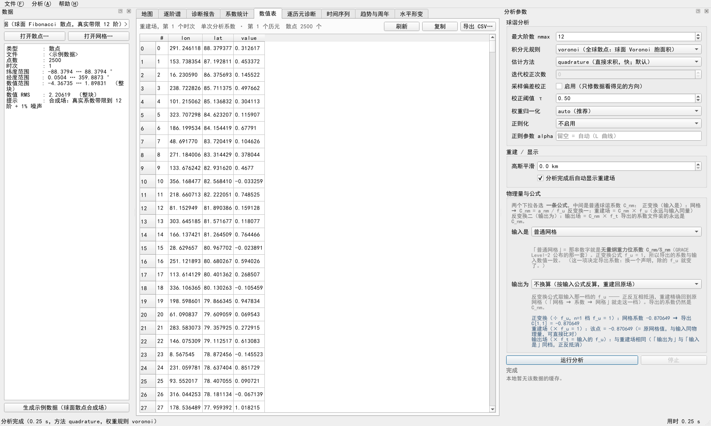

---

## 4. 操作流程

### 4.1 散点数据

1. **打开散点…** → 选 `csv / txt / dat / tsv / npy / xlsx`。默认按「第 1 列经度、
   第 2 列纬度、第 3 列数值」解释，带表头时优先按列名匹配；读入时的推断结果写在
   左侧数据摘要的「提示」里 —— **先看一眼提示**，列认错了就在文件里调整列顺序
   （或补一行列名）后重新打开。
2. 软件会**自动推断积分元规则**并设好下拉框：全球散点 → `voronoi`；
   只覆盖一个区域 → `delaunay`。
3. 设**最大阶数 nmax**。经验：`nmax ≲ √(N/4)`（有噪声时按此保守取），
   「诊断报告」里会给出**推荐 nmax**。
4. 点**运行分析**。完成后自动切到「重建场」并刷新报告、谱图、系数表。

**散点的多时次（同一个点、多个历元）**：支持，写成下面任一种即可 ——

| 写法 | 例子 |
| --- | --- |
| 矩阵 `.npy`（推荐，精度无损） | `(N, 2+ntime)`：第 1 列经度、第 2 列纬度、其余列 = 各历元 |
| 宽表 `csv/txt`，列名 `value, value1, value2…` | 本软件「逐时次导出」写出来的就是这个格式 |
| 宽表 `csv/txt`，**列名就是日期** | `lon,lat,2002-01-18,2002-02-17,…`（`2002-01`、`2002` 也行）→ 时间轴直接用这些日期 |
| 宽表 `csv/txt`，列名任意 | 需在读取时用 `val_col=["e2002","e2003"]` 指定是哪几列（GUI 目前按列名/位置自动认，认不出只会取第一列并在提示里说） |

读进来后和网格一样：地图上出现**时间行**，「运行分析」**一次解完全部历元**，
地图/播放/导出 GIF/逐时次导出都按历元走。

⚠️ **长表（tidy）格式不支持**：一行一个「点 × 历元」、另有一列日期的表，会被当成宽表
解释（只取第一列数值）。这种情况软件会给出**明确警告**并提示先透视成宽表，不会让你拿着
半份数据去分析。

### 4.2 网格数据

1. **打开网格…** → `nc / grd / npy / csv / txt`。选 `.nc` 时会出现「变量」下拉框，
   选好后点「载入」。纬度若原本是降序，读取时会自动翻转成升序并在摘要里注明。
2. 全球等经纬网格（且 `nlon == 2·nlat`、`nlat` 为偶数）会自动选 `dh`；
   其他情况选 `grid`（精确球带面积）。
3. 多时次数据用**时次滑块**切换；每次分析对应一个时次。要把所有时次一次解完，见 4.4。

**大文件打开得很快（懒加载）**：多时次 `.nc` 打开时**只读第 1 个时次**（外加文件头与
坐标轴），其余时次在**后台**按块补。实测那份 720×1440×256（1.06 GB）的 CSR mascon：
首屏 **0.61 s**，整块读要 **2.60 s**，补齐后两者**逐值一致**（省的是时间，不是精度）。
载入完成后状态栏会写「其余 N 个时次后台读取中…」，补齐完自动消失 —— 这段时间里
**地图、色标、时次滑块、播放、逐时次导出都能正常用**。只有"必须看全部历元"的操作
（批量分析、趋势/周年场、时间序列）才会先补齐并显示进度；时间序列页在补齐完成前
只画占位并写明原因，**不会为了让占位好看去读 1 GB**。

**左侧「数据摘要」里的数值范围 / RMS 是*当前时次*的**（行尾写明「（第 k/N 个时次）」），
切时次时会跟着刷新。多时次文件对整块求范围既不直观（几十个完全不同的场被压成一个
数字）又很贵；只有单时次数据才写「（整块）」。摘要里的其它信息（时间轴跨度、网格尺寸、
缺测个数、变量单位、提示）与当前时次无关，不随滑块变化。

### 4.3 区域数据（重要）

如果数据只覆盖地球的一部分：

- 积分元请用 **`delaunay`**。**不要用 `voronoi`** —— 球面 Voronoi 剖分永远铺满整个
  球面，区域边界点的胞会膨胀到球的对侧。
- 分析完成后**一定要看诊断报告里的「覆盖率」**。它 < 1 就说明你得到的是
  「区域外为 0」的全球系数，而不是真实全球系数。

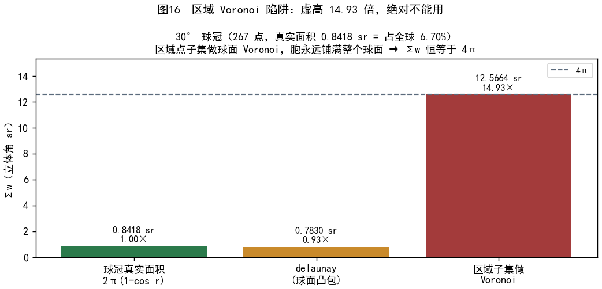

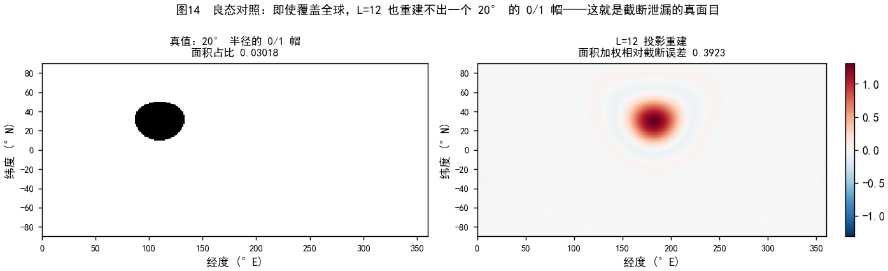

本程序对区域数据是**如实报告、不假装能反演**：它给出覆盖率、截断泄漏的量级和中文
警告，让你一眼看出「这不是全球解」。区域反演属于另一个层次的问题（数据本身在数学
上欠定），不在本程序范围内。

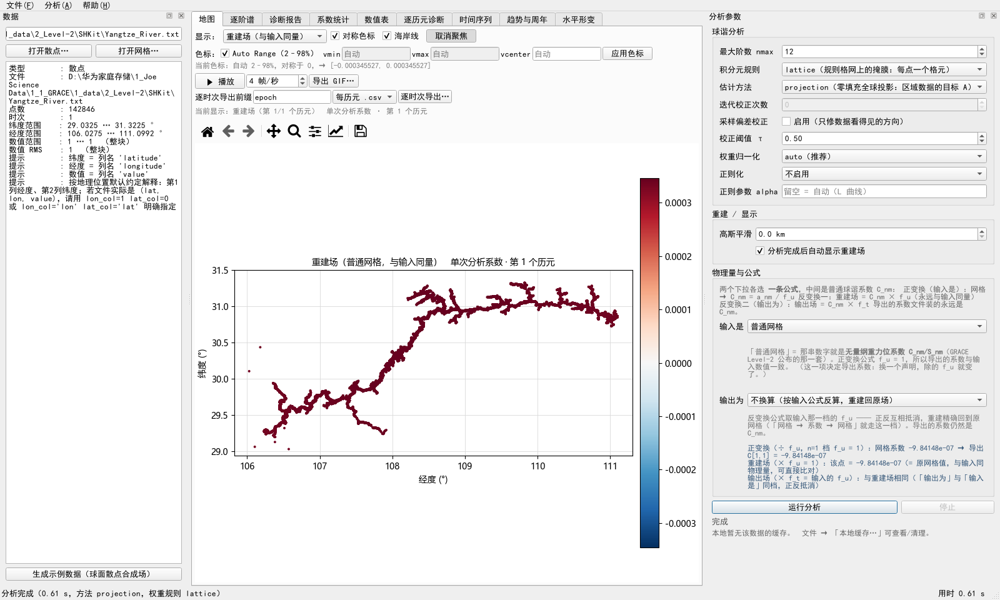

上面是区域数据的真实截图：长江流域 0/1 掩膜（142 846 点），`nmax = 12`、
规则 `lattice`、方法 `projection`。注意色标只有 ±3×10⁻⁴ —— 区域数据得到的
「全球系数」在区域外几乎处处为 0。

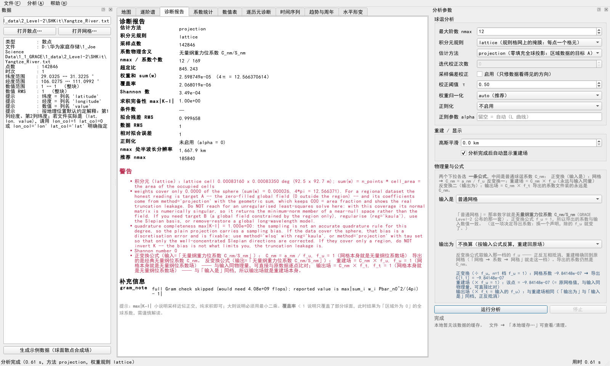

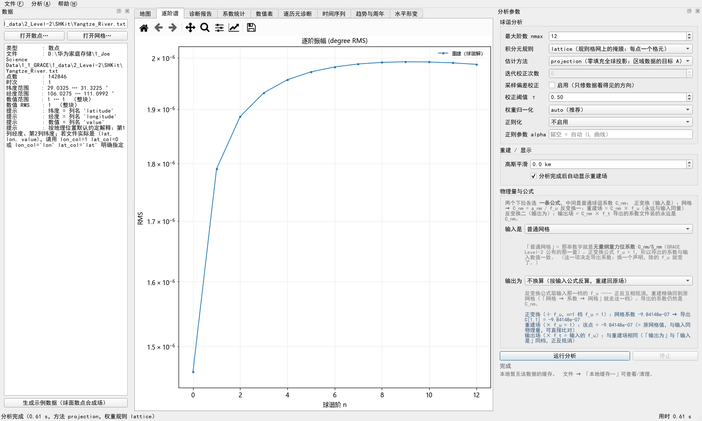

> **同一份区域数据，方法选错会得到什么？** 把方法换成 `cg`：**C00** 与点集加权均值
> 不再一致（软件会明确报警），重建场整体偏移 —— 这也是「一定要看诊断报告」的原因。

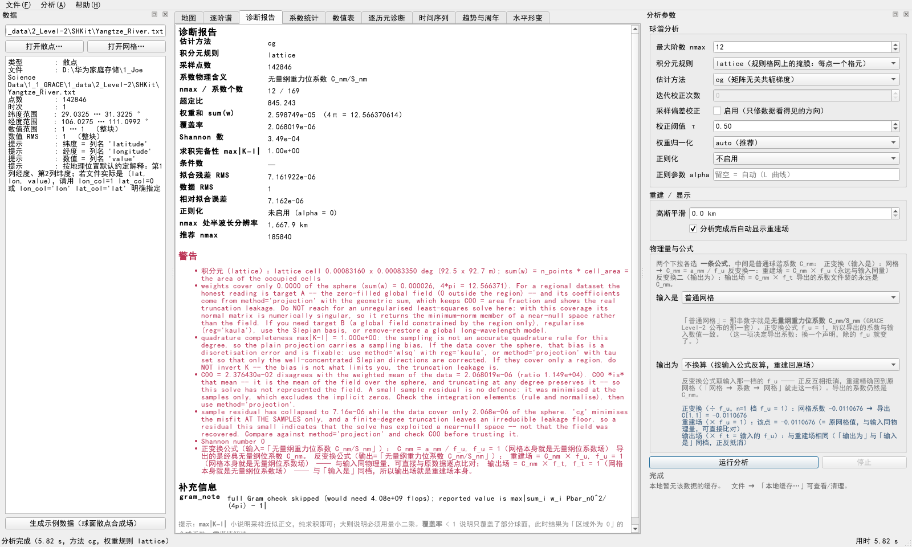

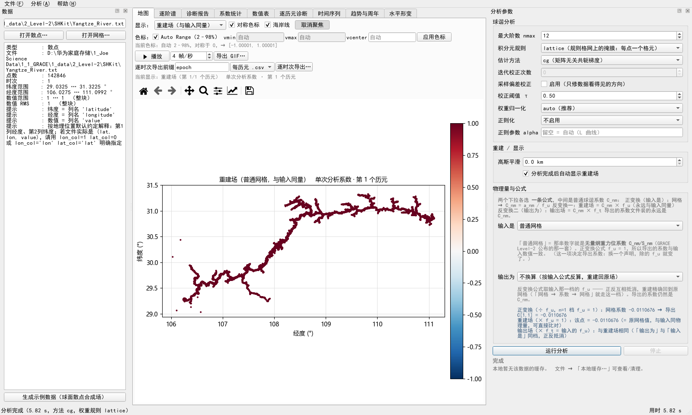

### 4.4 多时次（多历元）数据：一次解完

如果打开的数据带时间维（多时次网格）或有多列数值（散点的多历元），地图页上方会
出现**时间行**与**播放行**：

- **时次滑块**选一个时次；**◀ / ▶** 前后各一步；**范围**两个数字框限定参与后续处理的
  时次区间（**「全部」**恢复）；当前时次的日期与十进制年显示在右边。范围写反了软件会
  自动纠正，不会出现空窗口。
- **▶ 播放**按设定帧率逐时次放动画，播到区间末端**自动停、不循环**；
  **导出 GIF…** 把整段动画存成一个 GIF 文件（不需要额外的视频软件）。
  播放的是**当前「显示」的那张图**。选「重建场/差值/输出场」时，如果手上还没有逐历元
  系数，程序会**先一次解完全部历元**（进度条显示进度），然后每一帧只是从系数**综合**出来
  —— 所以不会出现"每一帧都一样"或"播的是原始图"。
- **逐时次导出…** 把区间内每个时次各存一个文件（网格 nc/grd、散点 csv），
  可**暂停 / 继续 / 停止**；暂停时一个文件都不会写，不会留下半截文件。

**一次解完所有时次**：多时次数据点**「运行分析」**就会一次解完全部历元（见 §3.4 与
常见问题）。也可以切到**逐历元诊断**页点**批量分析** —— 两者是同一个求解，结果
**逐位相同**：积分权重与法方程只组装一次，所以历元越多省得越多（实测 203 个历元、
1° 全球、nmax = 60：逐历元点 200 多次约 13 秒，批量一次约 0.5 秒）。

**结果会缓存到本地**：解完的逐历元系数写成数据文件旁边的 `<文件名>.shkit-coeffs.npz`
（数据目录不可写时退到用户缓存目录，并在状态栏说明）。键里含源文件的
`mtime/size` 与**所有影响系数的参数**（nmax、积分元规则、估计方法、迭代次数、tau、
归一化、正则、alpha、正则幂、**高斯平滑半径**、输入/输出物理量），任一项不同就不算命中
—— 所以"改了参数却拿到旧结果"不会发生；下次打开同一份数据（同一套参数）直接读缓存，
不再等一次求解（进度条会推到 100% 并写明"本次未重算"）。

**缓存占多大、会不会一直涨**（两点都管住了）：

| 位置 | 增长方式 | 上限 |
| --- | --- | --- |
| 数据文件旁边 `<文件名>.shkit-coeffs.npz` | **一个数据集一份**，改参数就覆盖同一个文件 | 单份 **256 MB**；超了**不写盘**并在状态栏说明 |
| `%LOCALAPPDATA%\SHKit\cache`（数据目录不可写时才用） | 按"数据集 × 参数"散列，**会越攒越多** | 总量 **512 MB**；每次写盘后按最久未用自动删到 80%，并写明删了几份、释放多少 |

参考大小：nmax = 60、256 个历元的一份实测 **7.0 MB**（真实 mascon 场）；nmax = 120 约 58 MB。

**清缓存**：**文件 → 「本地缓存…」** 显示当前数据那份缓存的大小与时间、用户缓存目录的
份数/总量，两个按钮就地清理（删除当前数据的缓存 / 清空用户缓存目录）。**缓存只是省时间，
删掉不影响已经算出来的结果**（本次会话照常可用），下次「运行分析」会重算并重写。
参数面板底部那一行也常驻显示当前占用。

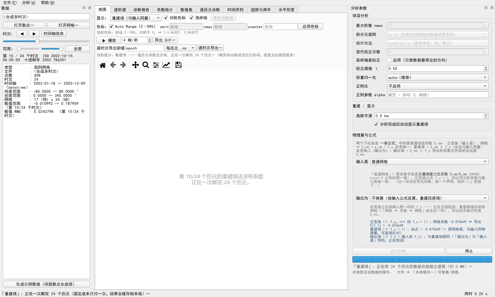

### 4.5 逐历元诊断：把坏历元挑出来

批量分析完成后，表格里**每个历元一行**：序号、日期、相对 RMSE、C00、残差 RMS、
可疑标记。相对残差明显偏大的历元会被标出来（用中位数绝对偏差判据），**但只高亮、
不自动剔除** —— 要不要丢掉一个历元是科学判断，不是软件的默认动作；关掉「高亮离群
历元」开关即可取消标记。

**点表格里的任意一行**会跳到那个历元的**地图**页，便于当场看它长什么样。表格上方还会
写明「权重与法方程只算了几次」，以及一键把整张表导出成 CSV。

分析在**独立子进程**里跑（默认开启，右侧面板有开关）：这样即使求解过程出问题，界面
本身也不会被拖垮。若系统环境不支持，程序会**回退到线程并写明原因**，而不是悄悄换一种
方式。

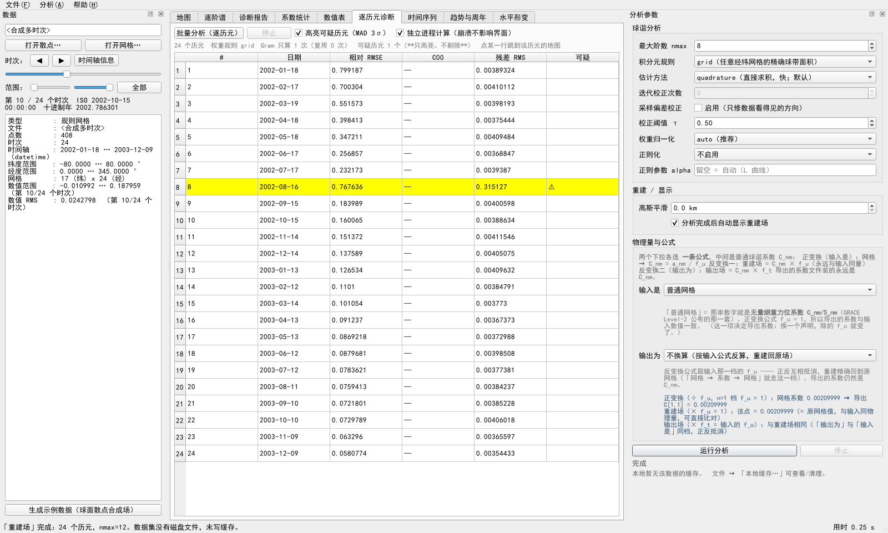

### 4.6 时间序列：某个点（或某个区域）随时间怎么变

选**单点**或**区域**：

- **单点**：给经纬度，程序吸附到最近的格点（或最近的点），并告诉你离所选位置有多远
  —— 避免「以为自己看的是那个点」。
- **区域**：给一个经纬度范围，程序做**面积加权**平均，并写明这个范围覆盖了球面的
  百分之几。区域平均是**覆盖面积内**的平均，不写覆盖率这个数没法解释。

勾上「拟合」会叠加**趋势线**与**周年拟合**曲线，并给出趋势（每年变化多少）、周年振幅
与**残差 RMS**；横轴是十进制年。拟合坐标用的是**真实经过时间**，历元不等间隔或有缺测
都按真实时间处理，不会把它们当作等间隔序号。

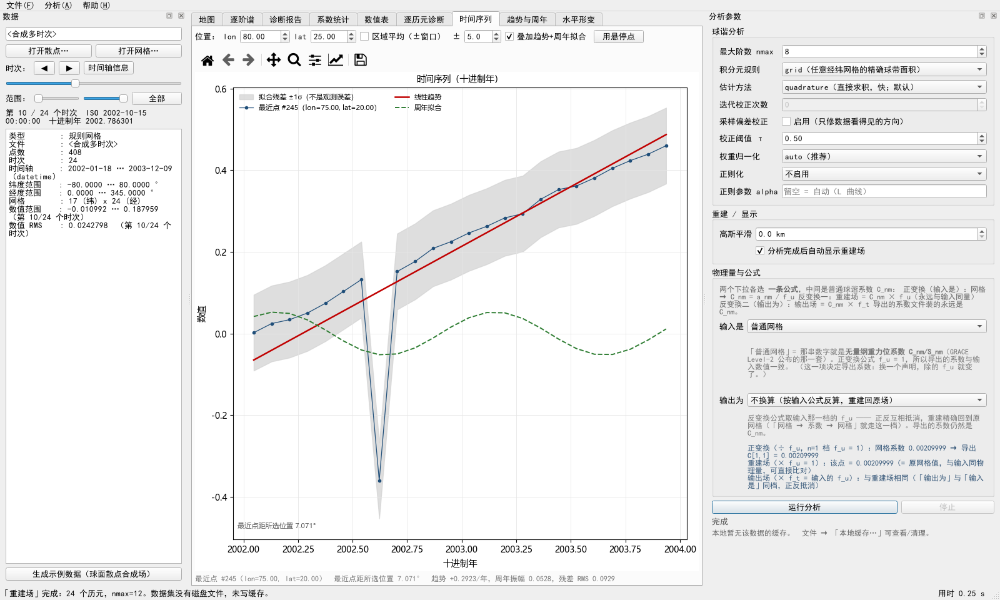

### 4.7 趋势与周年：把变化做成一张图

对**每个格点**做同样的时间拟合，给出：**趋势场**（每年），以及**每一个拟合了的周期**
各一对 **振幅场** / **相位场**（峰值出现在一年中的第几天）。只拟合年周期时是 3 张图；
勾上「含半年周期」就是 5 张（多出半年振幅场与半年相位场）。

> **相位图里的空白不是没算出来**：振幅接近 0 的地方「峰值在哪一天」没有意义（零正弦
> 没有峰），所以程序**逐周期**把振幅小于该场 98 分位 5% 的格子**遮掉**，并在标题里写明
> 遮了多少。这是有意的：一张填满噪声相位的图会被当成真信号读。

页面顶部会写明条件数、拟合了哪些周期、以及「有多少个格点参与了拟合」。数据**没有日期时
程序会拒绝拟合**并说明原因，而不是按序号假装等间隔。右上角的「海岸线」开关给这些图叠加
随程序分发的离线海岸线（不联网，只影响显示；只画海岸线，不画国界）。

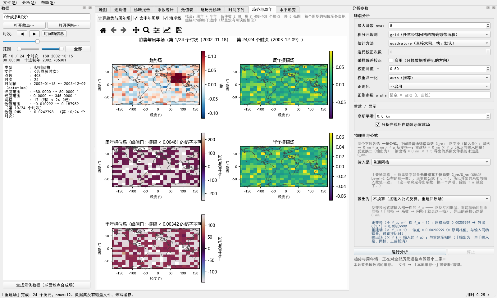

### 4.8 水平形变：质量迁移引起的水平位移

同样的系数还能给出水平地表位移。这一页是**可滚动的三行**（图按原尺寸画，不压扁）：

| 行 | 内容 |
| --- | --- |
| **北分量 u_N** | 向北为正；与东分量**共用同一个对称色标**，两行才能横向比较（各画各的色标会读成"东向比北向小"） |
| **东分量 u_E** | 向东为正 |
| **水平模 \|u_h\|** | 总位移大小（顺序色标，从 0 起），**叠加矢量场**并带一把**比例尺**：只有箭头没有比例尺的矢量图没法定量读，只有模又丢掉方向。箭头与左下角的比例尺文字都是**白色**（箭头带一层很细的深色描边，落在亮色格子上也看得清） |

**这一页在你点「计算水平形变」之前不会计算。** 运行分析、批量分析、拖时次、播放
都**不会**顺手把这张图算掉：它们只把旧图作废，并在页脚写明"点「计算水平形变」重算"。
点了之后：

- 计算在**后台线程/独立进程**里跑（进度条按"阶 m / 点块"报，随时可点「停止」取消）——
  位系数的球面梯度不是逐阶乘法：规则网格走经度 FFT（实测 720×1440、nmax=60 是
  **0.08 秒/历元**），但散点只能直接扫，同样规模要 **79 秒/历元**。所以这一步绝不能
  在界面线程里做，否则散点上一点按钮整个窗口就冻住；
- 换时次 / 重新分析 → 旧图作废（页脚说明它是哪个历元的），再点一次按当前历元重算；
- 「海岸线」开关只**重画**，不重算。

**可以导出**（文件菜单两项，每个历元写 3 个文件：`u_N` / `u_E` / `|u_h|`，单位 **m**）：

| 菜单项 | 写什么 |
| --- | --- |
| **导出水平形变（当前历元）…** | 当前时次的 3 个分量文件 |
| **导出水平形变（时间窗内逐时次）…** | 时间窗口内每个时次各 3 个文件，可**暂停 / 继续 / 停止** |

网格数据写成 `.nc`（一个文件一个分量，任何工具都读得进去）；散点写成 `.csv`（`lon,lat,值`）。
**散点上会先给出耗时估算**（例如"每个历元约 79 秒，256 个历元约 5.6 小时"）让你决定是否
继续 —— 这个估算不是吓唬人：散点直算就是慢，宁可先问一句也不要让人等一晚上。

**本页有自己的一套色标**，不跟随地图页的色标（地图页的量级常常是原始数据的，例如
EWH 的 ±700 cm；套到毫米级的形变分量上会把三张图压成一片颜色，看起来就是"画不出来"）。
本页按形变自己的数据自动定 2–98%，两个分量对称于 0（可横向比较），水平模从 0 起。

看这张图时注意三点：

- **量级**：真实的 GRACE 全球质量迁移引起的水平位移在**毫米量级**；如果图上出现米级
  数值，说明单位或系数口径有问题（软件会当场提示）。
- **极点不画箭头**：极点上的「东向」没有定义，画出来的箭头是假的，所以直接把 ±90°
  那一行排除掉并在标题里注明。
- **逐历元**：形变是逐历元的量；有多历元系数（运行分析/批量分析都会一次解完）时用
  当前历元那一片；一个历元都没有时会先一次解完整条序列，再算这张图。

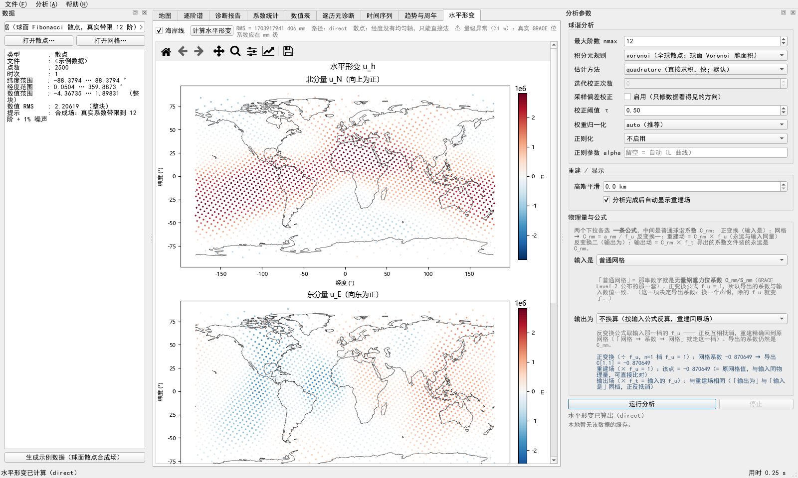

---

## 5. 参数含义

| 参数 | 说明 |
| --- | --- |
| **最大阶数 nmax** | 解到几阶，未知数 `(nmax+1)²` 个。拿不准先用默认值跑一次，诊断报告里的**「推荐 nmax」**就是按点数与覆盖率给出的经验上限 |
| **积分元规则** | **默认 `auto`**：按采样自动判断（全球等经纬网格 `dh`／完整网格 `grid`／规则格网上的掩膜 `lattice`／全球散点 `voronoi`／区域散点 `delaunay`）。见 5.1 |
| **估计方法** | **默认 `quadrature`（直接求积）**，效率优先：一次加权投影，最快。<br>可选：`iterative`（求积 + 迭代校正）／`projection`（区域数据的正确目标：区域外按 0 处理的全球投影）／`wlsq`（加权最小二乘）／`cg`（矩阵无关共轭梯度，省内存）。<br>⚠️ 用 `quadrature` 时若采样不是好的求积规则，会有混叠——看诊断报告里的 `gram max\|K−I\|`（> 1e-2 就改用 `wlsq` 或 `cg`） |
| **迭代校正次数** | 默认 **0**。**只在「估计方法 = iterative」时可用**（其它方法下这一项是灰的）。实测在散点上 1 次就能把往返误差改善 ~250 倍，代价是多扫一遍数据 |
| **权重归一化** | `auto` 推荐；`global` 强制 `Σw = 4π`（区域外为 0 的读法）；`region` 保留几何面积 |
| **输入是** | 【正变换公式】载入的网格/散点是什么（**普通网格 / geoid / EWH / 径向形变**，默认「普通网格」）。它决定 `C_nm = a_nm / f_u` 里的 `f_u`，**所以会改变导出的系数**。见 5.2 |
| **正则化** | 区域/病态数据必须用。`kaula` 是量纲无关的逐阶幂律先验 |
| **正则参数 alpha** | 留空 = 自动（L 曲线）；也可手填 |
| **高斯平滑** | 各向同性高斯滤波半径（0.5 幅度半宽），0 = 不平滑。分析完成后**直接乘到系数上**：导出的系数、逐阶谱、系数表、重建场/输出场都用同一个平滑结果，只施加一次 |
| **输出为** | 【反变换公式·输出场】输出场要换成哪个物理量（**不换算 / EWH / geoid / 普通球谐系数 / 径向形变**），决定 `输出场 = C_nm × f_t` 里的 `f_t`。它**不改变导出的系数**（永远是 `C_nm`），也**不改变重建场**；控件下方会实时显示两条公式的实际数字 |
| **在独立子进程中运行** | 默认**开启**。批量逐历元分析放在独立进程里跑：求解出问题也不会连带界面。环境不支持时会**回退到线程并写明原因**，不会悄悄换方式；两种方式的结果逐值相同 |

> **重建场 vs 输出场**：**重建场**永远与输入同物理量（`C_nm × f_u`），所以能直接和
> 原始网格逐点比对，差值图、残差 RMS 都用它；**输出场**是按「输出为」换算出来的
> 另一个物理量（`C_nm × f_t`）。选「输出为 = 不换算」时两者是同一个场。

### 显示相关控件（都不影响分析结果）

| 控件 | 说明 |
| --- | --- |
| **色标 · Auto Range** | 按 2% ~ 98% 分位自动定色标范围：比 min/max 稳健，不会被个别离群格点拉平整张图 |
| **色标 · vmin / vmax** | 手填后点**应用色标**生效（作用于**地图页与趋势页**）；**vcenter** 用来把「零」放在色标中间（例如正负异常图）。⚠️ 水平形变页有自己的色标，不跟随这里 |
| **对称色标** | 强制 vmin = −vmax。手填了 vcenter 时它会自动取消并在界面上说明谁在生效（避免「以为对称、其实不是」） |
| **海岸线 / 取消聚焦** | 海岸线来自随程序分发的离线数据，不需要联网（地图上**只画海岸线，不画国界**）；在地图上框选/滚轮放大后，用「取消聚焦」回到全球 |
| **时次滑块 / 范围 / 全部** | 只决定「当前看哪个（哪些）时次」。单时次分析用的是滑块那一个时次；批量分析与时间序列用「范围」 |
| **帧率 / 导出 GIF** | 播放速度与动画导出。GIF 的帧数等于当前范围的历元数 |
| **逐时次导出** | 把范围内每个时次各写一个文件；可暂停/继续/停止 |

### 5.1 积分元规则速查

| 规则 | 用在哪 |
| --- | --- |
| `dh` | 全球等经纬网格（`nlon=2·nlat`），精确到 `nlat/2−1` 阶 |
| `grid` | **任意经纬网格**（含区域、非等间隔），精确球带面积 |
| `voronoi` | **全球准均匀散点**，球面 Voronoi 胞面积 |
| `delaunay` | **区域散点**，球面 Delaunay 1/3 |
| `uniform` | 等面积采样；**不应用于任意散点**（实测差 10 倍以上） |

### 5.2 ⚠️ 物理量与单位：两条公式，一个中间量

管道里只有两条公式，中间是**普通球谐系数** `C_nm`（= 无量纲重力位系数
`C_nm/S_nm`，GRACE Level-2 公布的那一套）：

```
正变换（输入是）：  输入网格 ──÷ f_u──> C_nm = a_nm / f_u
反变换一（永远）：   重建场 = C_nm × f_u   ← 与输入同物理量，可直接比对
反变换二（输出为）： 输出场 = C_nm × f_t   ← 按「输出为」选的物理量

导出的系数文件 = C_nm
```

`a_nm` 是该网格**自身**的球谐系数（由数据与积分元唯一决定）。`f_u` 由「输入是」
选的物理量决定：

| 输入是 | 正变换公式 `f_u` |
| --- | --- |
| **普通网格**（默认） | 1（网格本身就是那套无量纲位系数场） |
| 水准面高 ΔN (geoid) | `R = 6378136.46 m`（**常数**，不逐阶） |
| 等效水高 EWH | `Aₙ = R·ρ̄/(3ρ_w) · (2n+1)/(1+k′ₙ)`（逐阶） |
| 径向形变 u_r | `R·h′ₙ/(1+k′ₙ)`（逐阶；`h′₀ = 0`，0 阶不可反推） |

**所以改「输入是」会改变导出的系数。** 同一块网格声明成 geoid 和声明成 EWH 是两个
**不同的物理场**，除的因子不同。同一份数据的实测结果：

```
输入是                 导出 C[2,1]
普通网格（默认）        -1.849162537627e-01   （f_u = 1，恒等）
geoid                 -2.899220719443e-08   （÷ R）
EWH                   -2.190855366513e-09   （÷ A₂）
径向形变 u_r            → 报错：h′₀ = 0，第 0 阶信息已丢失
```

geoid 与 EWH 之差在 n=2 阶是 `A₂/R ≈ 13.23` 倍，而且**逐阶不同**：

```
n=1:  ewh/geoid = 1.8600e-01      n=3: 6.2467e-02
n=2:  ewh/geoid = 7.5567e-02      n=6: 3.8056e-02     （跨 4.9 倍）
```

**改「输出为」则既不改变导出的系数、也不改变重建场**，它只换**输出场**：

```
输入=EWH，输出=EWH        → 输出场 = 重建场（f_t = f_u，正反抵消）
输入=EWH，输出=geoid      → 输出场 = C_nm × R（重建场仍是 EWH，一动不动）
输入=EWH，输出=普通球谐系数 → 输出场 = C_nm（f_t = 1）
```

同一份数据逐个改「输出为」，导出系数与重建场都逐位不变，只有输出场在动：

```
输入=ewh, 输出=ewh          导出 C[2,1] = -2.190855366513e-09  重建场 RMS = 2.206131e+00  输出场 RMS = 2.206131e+00
输入=ewh, 输出=geoid        导出 C[2,1] = -2.190855366513e-09  重建场 RMS = 2.206131e+00  输出场 RMS = 8.274777e-01
输入=ewh, 输出=普通球谐系数   导出 C[2,1] = -2.190855366513e-09  重建场 RMS = 2.206131e+00  输出场 RMS = 1.297366e-07
```

所以界面上是这样分工的：

- **「输入是」决定导出什么系数**（正变换公式 `f_u`）；
- **重建场**永远 = `C_nm × f_u`，与输入同物理量，用来做差值图与残差 RMS；
- **「输出为」决定输出场是什么物理量**（反变换公式 `f_t`）；
- 只做「网格 → 系数 → 网格」时，选「输出为 = 不换算」即可：`f_t = f_u`，
  输出场就是重建场，正反互相抵消；
- 声明矛盾（例如「普通标量 → EWH」）会抛出明确的中文错误，而不是给你一个错 1e7 倍
  的结果；
- 控件正下方有**实时预览**，把两条公式都写成具体数字：

  ```
  正变换（÷ f_u，n=1 档 f_u = 3.42909e+07）：网格系数 1.32588 → 导出 C[1,1] = 3.86658e-08
  重建场（× f_u = 3.42909e+07）：该点 = 1.32588（= 原网格值，与输入同物理量，可直接比对）
  输出场（× f_t = 6.37814e+06，相对输入 × 0.186001）：该点 = 0.246616
  ```

  换「输入是」时第一行的 `f_u` 会当场改变（换成 geoid 就变成 `6.37814e+06`）；
  选了具体的「输出为」后第三行会给出该物理量的数字与相对倍数。每次分析完成后也会刷新。

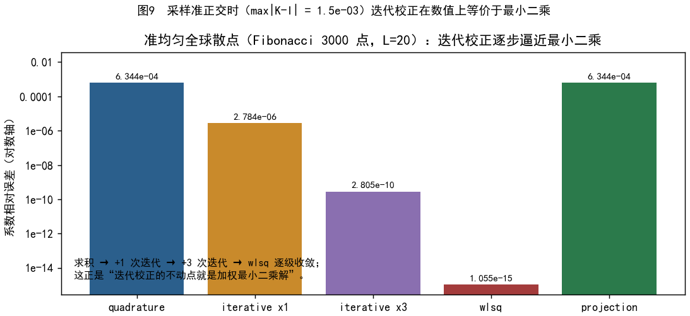

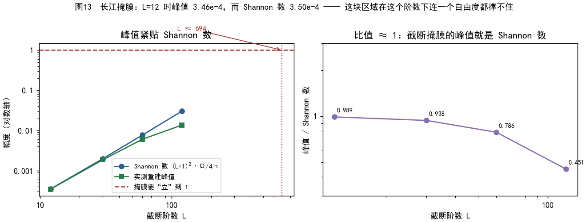

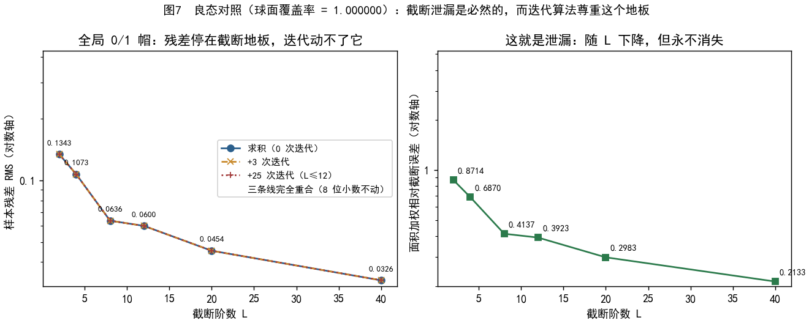

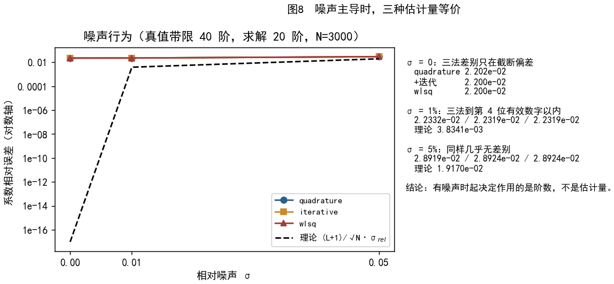

> 上面几张是几组**实测结论配图**：它们把「算法选哪条」「阶数取多少」这两件事画了
> 出来，选参数时可以对照着看。

---

## 6. 怎么读诊断报告

诊断报告页签逐项列出，关键四项：

| 指标 | 怎么看 |
| --- | --- |
| **求积完备性 max\|K−I\|** | < 1e-2 ⇒ 采样近似正交，纯求积就够；明显大于 ⇒ 求积有混叠，**必须用最小二乘** |
| **覆盖率** | = `sum(w)/4π`。< 0.999 ⇒ 只覆盖部分球面，结果是「区域外为 0」的全球系数，速度要谨慎 |
| **条件数** | > 1e8 ⇒ 双精度已耗尽，必须降阶或加正则化 |
| **推荐 nmax** | 按点数与覆盖率给的经验上限；比它高就是在解噪声 |

报告底部还会给出中文警告（覆盖率不足、超定比 < 2、Shannon 数过小、条件数过高），
有警告时用红色列出。

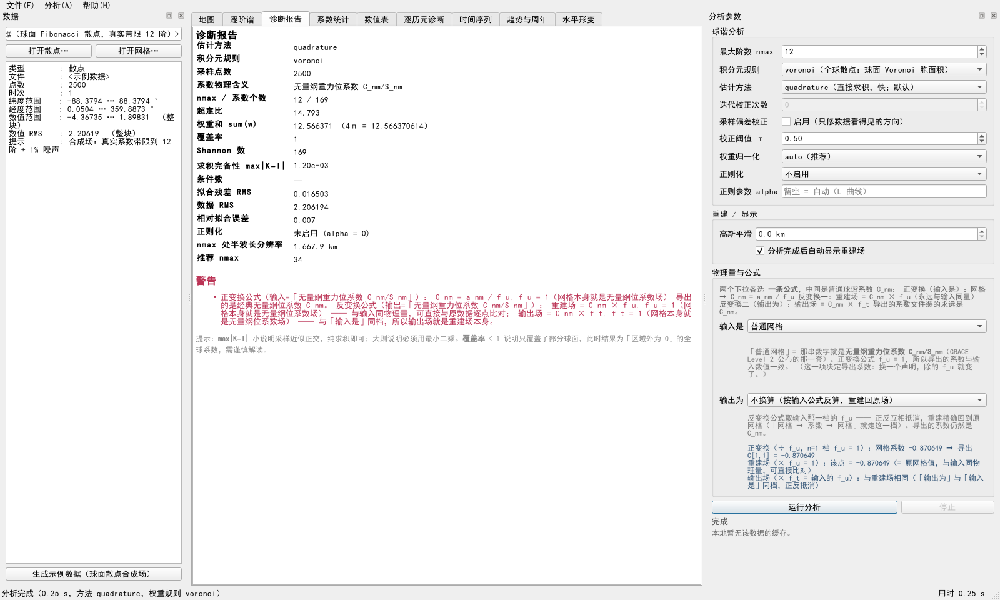

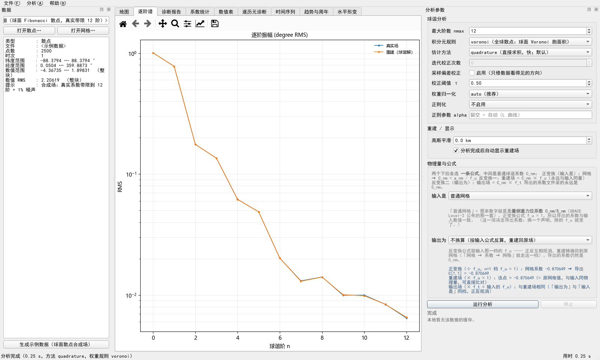

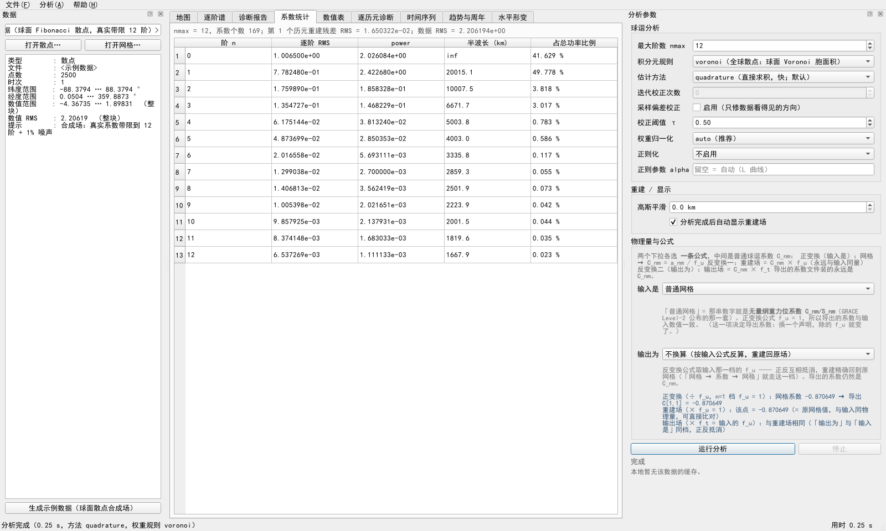

---

## 7. 导出

| 入口 | 格式 |
| --- | --- |
| 文件 → 导出球谐系数 | `.sh/.txt/.csv`（三角布局，与 gridSHconvert / m2py 兼容）、`.gfc`（ICGEM/GFZ）、`.npy`、`.npz` |
| 文件 → 导出重建场（与输入同量） | 网格：`.nc` / `.grd`；散点：`.csv` / `.txt` / `.npy` |
| 文件 → 导出输出场（按「输出为」） | 同上；量纲由「输出为」决定 |
| 文件 → 导出诊断报告 | `.json` / `.md` |
| 文件 → 导出水平形变（当前历元 / 时间窗内逐时次） | 每个时次 **3 个文件**：`u_N` / `u_E` / `\|u_h\|`（单位 m）。网格 `.nc`（变量名 `uN`/`uE`/`umag`）、散点 `.csv`（`lon,lat,值`）；逐时次那条可暂停 / 继续 / 停止 |
| 数值表页 → **复制** / **导出 CSV** | 整块场的数值表。格点数超过 3 万时自动抽稀（**并在页面上写明抽样步长**，免得把抽稀表当成全分辨率） |
| 地图页 → **导出 GIF…** | 当前时次范围的动画；帧数 = 范围内的历元数（不需要额外的视频软件） |
| 地图页 → **逐时次导出…** | 范围内每个时次各写一个文件：网格 `.nc` / `.grd`、散点 `.csv`；可暂停 / 继续 / 停止 |
| 逐历元诊断页 → **导出 CSV** | 逐历元诊断表（日期、相对 RMSE、C00、残差 RMS、可疑标记） |
| 时间序列页 → **导出 CSV** | 当前曲线（时次 + 数值） |

> `.gfc` 是单历元格式。多时次数据导出 `.gfc` 时，软件用的是**当前时次**；
> 需要全部时次请选 `.npz`，或用上面的「逐时次导出」。

---

## 8. 常见问题

**Q：为什么中文显示成方框？**
A：绘图库自带的字体没有中文字形。程序启动时会自动挑选系统里安装的中文字体
（Microsoft YaHei / SimHei / Noto Sans CJK / PingFang 等）；如果机器上一个都没有，
装一款中文字体即可。

**Q：地图上没有海岸线？**
A：检查「海岸线」复选框。海岸线数据随程序分发，不需要联网。（国界**不画**：那份数据随包
附带，但地图上只保留海岸线，免得虚线在判读场分布时变成噪声。）

**Q：地图上出现「飞线」（横穿整幅图的长直线）？**
A：这是经度跨越 ±180° 时折线被错误连接造成的。本程序已经在渲染前检测相邻点的经度
差，凡超过 180° 的地方插入断点，所以正常数据不会出现；如果你自己处理过的数据仍有
飞线，通常是经度用了 `0…360` 而纬度范围与之不匹配，把经度归一到 `−180…180`
（或反过来统一）即可。

**Q：分析跑很久，能停吗？**
A：能。「停止」是**协作式取消**：程序会在阶数循环、法方程组装、迭代求解处检查取消
标志。已经进入的单次大规模数值运算无法中断，所以可能要等当前一步结束。

**Q：nmax 设很大但结果很差？**
A：看诊断报告的「推荐 nmax」和「条件数」。阶数超过采样能支撑的上限时，解会去拟合
噪声，系数范数会爆炸。

**Q：区域数据怎么都做不出全球系数？**
A：这是**原理性限制**，不是软件问题。区域数据在数学上欠定；一个占球面 4.3% 的球冠
连 degree-4 的场都恢复不了（低阶场弥散在全球，集中因子只等于面积占比）。所以本程序
只给「区域外为 0」的全球系数 + 覆盖率与泄漏量级，并明确警告；真正的区域反演需要另
一套方法，不在本程序范围内。

**Q：「批量分析」和「逐个时次点运行分析」结果一样吗？**
A：一样，**逐位相同**。批量只是把积分权重与法方程只组装一次，所以快得多；每个历元的
方程与单次分析完全一致。它跑在独立子进程里，出问题也不影响界面。

**Q：为什么我的结果和别人的产品整体差一个常数倍（例如 3.5 倍）？**
A：先查**归一化口径**，不要急着怀疑算法。同一个物理场，有人用「4π 归一化」，有人把
归一化因子折进系数或公式里，两边的数就会整体差 √(4π) ≈ 3.545 倍（实测就是 3.54）；
这属于**约定差异**，不是谁算错了。判断方法很简单：**图形应该高度相似（相关系数接近
1），只是整体标度不同**。如果图形也对不上，那才是物理或处理口径的问题。

**Q：趋势与周年页里的相位图为什么有大片空白？**
A：那里是**故意留白**。振幅接近 0 的格点上「峰值出现在第几天」没有意义，程序把振幅
很小的格子遮掉并在标题里写明遮了多少。想看到全部格子可以调低这个门槛，但请记住：
那些格子的相位是噪声，不是信号。

**Q：时间序列曲线上的点比我数据里的历元少？**
A：那一段范围内的历元没有全部参与 —— 缺测历元（整列无效值）会被排除，页面会写明实际
用了多少个历元。程序不会把缺测当成 0，也不会把它当成等间隔的一个点。

**Q：结果量级看起来差了 100 倍（例如形变 RMS 是 86 mm 而不是 0.9 mm）？**
A：先看左侧数据摘要里的「**变量单位**」。**SHKit 的正变换、反变换以及各物理量之间的换算
全都是线性的**，所以**输入什么单位，输出就是同一套单位的倍数** —— 往返（原始 ↔ 重建）、
EWH ↔ geoid ↔ 形变之间的比例**都不受单位影响，不需要做任何换算**。唯一与单位有关的是
**打印出来的绝对物理量**（`m` / `mm` 标签）和「真实 GRACE 应在 mm 级」这类**按米写的量级
自检**：文件声明的若是 `cm`，这些数字要按 cm 读（**÷100 才是米**）。水平形变页遇到这种
情况会在数值后面写明。

**Q：播放动画（或拖动时次）时，只有「原始场」在变？**
A：那说明手上只有"某一个历元"的系数。现在**多时次数据点一次「运行分析」就解完全部历元**
（也可以到「逐历元诊断」页点「批量分析」，两者同一个求解），之后重建场/差值/输出场会随
滑块与播放逐历元重算，标题上标出用的是哪个历元；逐历元系数还会**缓存到本地**，下次打开
同一份数据（同一套参数）直接读，不必再解一遍。

**Q：「显示」切到重建场，图却还是原始数据（或者播放时每一帧都一样）？**
A：这是 v2.0 修掉的一个真问题。现在有四条保证：

1. **一次解完，不逐个补算**：需要逐历元系数时（切「显示」、播放、导出）程序**一次解完
   全部历元**——固定成本（积分元、法方程）只付一次，每历元边际成本毫秒级，所以"解一个"
   和"解全部"几乎一样贵。解的过程在进度条上，提示行写明"正在一次解完 N 个历元…"。
2. **没有系数就不画**：还没有系数时，地图上写的是"第 k 个历元的…还没有系数，正在一次解完
   N 个历元…"，**不会**拿原始数据冒充（以前会，看起来就像"切了没反应"）。
3. **不拿别的历元顶替**：`self.recon` 只对"它解的那一个历元"成立；换到别的历元一律按
   该历元的系数重算，算完自动换成该历元的图。
4. **每一帧都是它自己那个历元**：播放/导出时不会把同一张图重复放或拿原始图顶上。
   **导出 GIF…** 与**逐时次导出**都会先一次解完再导；逐时次导出写出的每个历元文件里是
   **它自己**的场（不会把同一个场写给每个历元）。

**Q：结果缓存在哪？会不会"改了参数拿到旧结果"？会不会无限涨？**
A：缓存写在数据文件旁边（`<文件名>.shkit-coeffs.npz`）；数据目录不可写时退到用户缓存
目录，并在状态栏写明。键包含源文件的 `size / mtime / 前 64 KB 的内容指纹` 与全部影响
系数的参数（含**高斯平滑半径**和输入/输出物理量），任一项不同就不算命中、直接重算并
覆盖 —— 所以不会串。**键里不含路径**，所以数据（连同旁边的缓存）拷到别的目录/别的机器
仍然命中。命中时状态栏与「逐历元诊断」页都会写明"这是本地缓存、不是本次重算"。
**载入数据时，如果参数与缓存里的不一致，界面会先把参数（含「输入是」）切回缓存那一套**，
并在状态栏与参数面板写明"已按这份缓存切回参数"—— 于是点「运行分析」直接读缓存、不重算。
（「输入是」是公式的一部分，声明成 geoid / EWH / geopotential 除的因子不同、系数也不同，
所以它必须在缓存键里；正因为如此，默认值与你上次用的不一致时就需要自动切回来。）

**有缓存时点「运行分析」会先问你一句**（「批量分析」同理）：

> 这份数据已经有一份本地缓存（数据文件旁边，7.4 MB，写于 …）：参数：输入是=ewh、
> nmax=60、积分元=dh、估计方法=quadrature。与当前界面参数一致。当前内存里的结果：就是
> 这份缓存读回来的。
> ［**直接读缓存（不重算）**］　［重新计算（覆盖缓存）］　［取消］

默认按钮是「直接读缓存」；选「重新计算」会按当前界面参数解一遍整条序列并把缓存覆盖成新
的；选「取消」则缓存不读、也不重算，内存里的结果保持原样。**导出 GIF 与切视图时的自动
补算不会弹这个框**（那里插一个模态框只会把人卡住），它们直接用缓存并在状态栏说明。

想用别的参数：改完直接点「运行分析」，会按新参数重算并覆盖缓存（这时**不弹框** —— 你刚
刚设的参数就是你要的）。
增长性分两处：数据旁边**一个数据集一份**（改参数覆盖，单份上限 256 MB，超了不写盘），
用户缓存目录是"数据集 × 参数"一份、本来会一直涨 —— 现在有 **512 MB 总量上限**，每次写盘
后按最久未用自动修剪。想看占用或清掉：**文件 → 「本地缓存…」**（删掉不影响已算出的结果）。
参数面板底部那行提示按**能不能命中**说话：如果旁边那份缓存与当前文件/参数对不上，它会
直接说"不会命中，会重算并覆盖"，不会让你以为不用等。

**Q：点了「运行分析」前几秒进度条不动，是在卡吗？**
A：不是。有两段**本来就没有可信百分比**的工作：① 懒加载的大文件要把全部时次读进来
（真实 mascon 实测约 3 秒），② 独立进程模式下要把数据交给子进程。这两段现在显示的是
**会自己动的忙碌条** + 一句话说明（"正在读取全部时次 128/256…"、"正在把 256 个历元的
数据交给独立进程…"）；一旦求解器报出真实百分比，自动切回百分比条。空闲时进度条直接
隐藏，不留一根 0% 的条。

---

## 9. 作者与联系方式

| 作者 | 彭桢燃（Zhenran Peng） |
| --- | --- |
| 单位 | 中国地质大学（武汉）<br>China University of Geosciences (Wuhan) |
| 邮箱 | zhenran.peng@cug.edu.cn |
| 电话 | 15927402265 |
| 公众号 | 地球重力与人类生活（TVGG），微信扫一扫： |


使用中如发现问题、或有功能建议与数据方面的疑问，欢迎通过邮箱或公众号反馈。

## 10. 致谢

本程序使用了若干开源软件组件，并在开发过程中使用了 Natural Earth 110m 海岸线数据
与 PREM 载荷勒夫数表（Wang et al. 2012）。这些组件与数据的著作权归各自作者所有，
许可全文随程序分发，可在 **帮助** 菜单中查看。

本软件仅供科研与教学使用。软件按「现状」提供，作者不对使用结果作任何明示或暗示担保。
